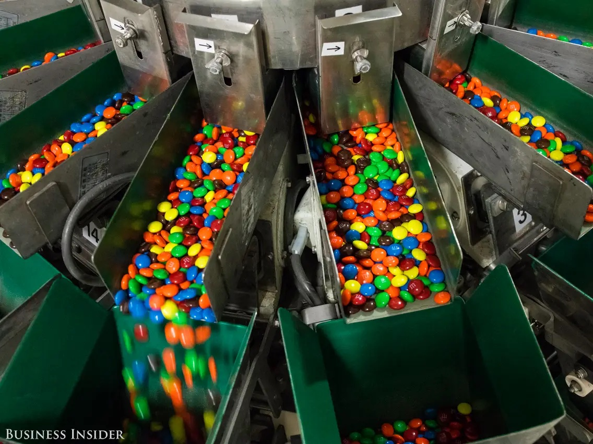
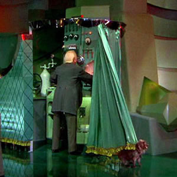

# STAT 131A, Fall 2024: Homework 2 Coding Questions

## Question 1: Spam classification with Naive Bayes (optional)

**Note: Question 1 is now optional. If you decide to complete it, it is worth up to five points of extra credit.)**

Make sure to run the cell below before getting started.

```{r}
# Load in additional functions
library(tidyverse)
library(lubridate)
library(glue)

# Use three digits past the decimal point
options(digits = 3)

# Format plots with a white background and dark features.
theme_set(theme_bw())

# This is where the spam data is stored on DataHub.
SPAM_PATH = "data/spam.csv"

# Read in the data
spam = read_csv(SPAM_PATH)

# Each row represents an email.
# spam: a binary column indicating whether the email is spam
# All other columns denote the binary presence or absence of a particular
# string in the email.
head(spam)
```

### Part A

Using the `spam` data, calculate the proportion of emails that are spam, and the proportion of emails that are not spam.

-   Save these values as `p_spam` and `p_not_spam`, respectively.

-   Your answer should not use the functions `sum` or `length`!

```{r}
# Your code here!

```

### Part B

With the `group_by` and `summarize` functions you used in HW1, estimate $\Pr(\text{free} | \text{spam})$ and $\Pr(\text{free} | \text{not spam})$.

-   Your answer should be a dataframe with two rows and two columns.

```{r}
# Your code here!

```

### Part C

Next, estimate $\Pr(\text{word} | \text{spam})$ and $\Pr(\text{word} | \text{not spam})$ for **all** words in the `spam` data.

-   Your answer should be a two-row dataframe. One column should indicate the groups: spam or not spam. There should also be column for each word in the `spam` data.

-   Hint: The `summarize_all` function may come in handy. To learn how it works, either read the documentation for `summarize_all`, or ask PingPong!

```{r}
# Your code here!

```

### Part D

We now have everything needed to estimate the numerator of your Naive Bayes expression for $\Pr(\text{spam} | \text{words...} )$ and $\Pr(\text{not spam} | \text{words...} )$!

For an email containing the words "free" and "money", estimate the numerator of your Bayes' Rule expression for $\Pr(\text{spam} | \text{free}, \text{money} )$ and $\Pr(\text{not spam} | \text{free}, \text{money} )$.

-   To do this, you will need to manually look up the relevant values in the dataframe you generated in Part C.

-   Based on your model, is an email containing the words "free" and "money" more likely to be spam or not spam?

```{r}
# Your code and code comment here!

```

### Part E

If we had many emails, it would be inefficient to manually calculate the numerator of the Bayes' Rule expression over and over.

-   So, let's write a function to automate this process!

First, note that we can represent each email as a boolean vector, with one element indicating whether the email is spam, and one element for each string in the `spam` data:

```{r}
# This is one row of the spam dataframe, which represents one email.
# The first element inside [ ] indicates the row numbers to select.
# The second element indites the column numbers to select.
# If the second element is empty, all columns are selected.
spam[1, ]
```

```{r}
# We can convert this one-row dataframe into a boolean vector with `as.logical`.
email_vector = as.logical(spam[1, ])
email_vector
```

With `R`, we can use a boolean vector as a **mask** to select elements from another vector:

```{r}
a = c(FALSE, FALSE, TRUE, TRUE)
b = c(1, 2, 3, 4)

# Do not select the first or second element of b,
# but do select the third and fourth element. 
b[a]
```

Suppose we had a boolean vector of the words in a given email, along with a vector of the corresponding $\Pr(\text{word} | \text{spam})$ values. *Note*: You can obtain a vector for all $\Pr(\text{word} | \text{spam})$ values from the dataframe you generated in Part C.

-   First, we can use the boolean email vector to filter the vector of $\Pr(\text{word} | \text{spam})$ values, so that we only have the $\Pr(\text{word} | \text{spam})$ values corresponding to the actual words in the email.

-   Then, we can calculate the product of the filtered vector. The `prod` function in `R` calculates the product of all elements in a vector, similar to how `sum` calculates the sum of all elements in a vector.

-   Finally, we can multiply the product by $\Pr(\text{spam})$ to get the numerator of the Bayes' Rule expression for $\Pr(\text{spam} | \text{words...} )$.

-   We can do the same using $\Pr(\text{not spam})$ to obtain $\Pr(\text{not spam} | \text{words...} )$.

Your task:

1.  Write a function that takes in a boolean email vector and returns `1` if the email is more likely to be spam than not spam, and `0` otherwise.

2.  Apply your function to every row of the `spam` dataset using the `apply` function.

    -   You can apply a function `FUN` to every row of a dataframe `df` using `apply(df, 1, FUN)`.

3.  What proportion of emails in the `spam` dataset were correctly classified by your model?

```{r}
# Your code here!

```

## Question 2: Introduction to inference with M&M's

### M&Ms data generating process

Suppose M&M's bags are filled with candy by an unobserved machine. It might look something like this:

{width="300"}

As experienced candy-connoisseurs and budding data scientists, suppose we're interested in an important question:

-   On average, what proportion of M&M's are primary colored (i.e., yellow, red, or blue)?

In other words, we're interested in **inferring a property of an unobserved machine that randomly generates bags of M&Ms.**

-   If we designed the machine ourselves, then we wouldn't need the tools of statistical inference. We could just read off the setting for "proportion of candies that are primary colored".

-   Instead, all we observe is a single bag of M&M's. Our goal is to use this single bag to say something meaningful about the unknown factory setting.

If you've seen the [The Wizard of Oz](https://www.youtube.com/watch?v=ivRKfwmgrHY), you might draw an analogy to the unobserved man behind the curtain controlling what Dorothy et al. observe:



This HW will lead you through the process of using a single bag of M&M's (the *sample*) to infer properties of an unobserved M&M's machine (the *population*, or the *data-generating process*).

> At this point, it's natural to worry that filling bags with candy is totally unrelated to your future career prospects. However, this setup is surprisingly common in industry settings.
>
> For example, suppose you're a product manager who is interested in understanding your customer base. If we survey a random sample of customers, we can think of the aggregate opinion of the entire customer base as the properties unobserved M&M's machine, and our survey results as the observed bag of M&M's.
>
> Same idea if you're a pollster trying to understand the fraction of all voters who identify as Republicans when all you get to observe is a small sample of voters.
>
> The methods taught in this notebook are used *constantly* by practitioners.

### 🍬 Generating the data

If you attended Lecture 7 in person, you received a fun-sized bag of M&Ms. Before eating your M&Ms, you reported the count of M&Ms of each color.

##### 🚀 Exercise 1

Report the count of your M&Ms in the code cell below.

-   Your data should have been emailed to you when you submitted the M&Ms data collection form.

-   If you do not have access to your M&Ms data, please locate it in the [aggregated data](https://docs.google.com/spreadsheets/d/1vgCLFiMCXL2ihfq-9vIiJT5lvlymHLjiD14LbS0-x6g/edit?usp=sharing).

-   If you did not attend lecture, please use any student's data as your own.

```{r}
n_primary_colored = NA

n_not_primary_colored = NA

```

### ☝️ Point estimates

Our first objective is to provide a *point estimate*, or single best guess, of the *population* proportion of M&M's that are primary colored.

-   This is a setting on the M&M's machine that generated our bags. Remember, **the settings are not observed by us!** If they were observed, we wouldn't need the tools of inference.

##### 🚀 Exercise 2

In the code cell below, provide a point estimate for the population proportion of M&M's that are primary colored.

```{r}
# Update the code below!

my_point_estimate = NA

print(my_point_estimate)
```

### ❓ Uncertainty

Point estimates are often straightforward to calculate.

Here's the problem: With only one bag of M&M's, how sure are you of your point estimate?

-   If you were instead given a different bag of M&M's, would you have had the same point estimate?

-   If you were instead given a smaller bag of M&M's, would you be less confident of your point estimate?

-   If you were instead given a Costco-sized plastic tub of M&M's, would you be more confident of your point estimate?

What's going on here is **counterfactual reasoning**. In statistical inference, we need to think about **what could have happened in parallel universes**.

The (unobserved) distribution of point estimates across these parallel universes is called a **sampling distribution**. This idea powers [frequentist statistical inference](https://en.wikipedia.org/wiki/Frequentist_inference#Relationship_with_other_approaches)!

### 👩‍🚀 Observing parallel universes?!

We're in an exciting scenario where we can actually *observe parallel universes* where other point estimates were generated. Most of your classmates have also gathered data from their own small random sample of M&Ms.

> It's important to stress that **this is an unrealistic scenario**. We normally only see one sample of data.

If we plot the point estimates from all students in the course, we can get an approximation of the theoretical sampling distribution.

##### 🚀 Exercise 3

Plot the distribution of your and your classmates' point estimates for the proportion of M&M's that are primary colored.

-   Draw a vertical line on your plot indicating the value of your own point estimate.

-   You can download the [classwide data](https://docs.google.com/spreadsheets/d/1vgCLFiMCXL2ihfq-9vIiJT5lvlymHLjiD14LbS0-x6g/edit?usp=sharing) as a CSV, and store it either on DataHub or your local machine.

-   The data is also located in the `data` folder.

*Reminder*: In general, we expect to see plots that are appropriately formatted for readability.

```{r}
# Your code here!

```

##### 🚀 Exercise 4

Aggregate all of your classmates data into one giant "super sample" of M&Ms.

-   In the code cell below, calculate the proportion of the "super sample" that is primary colored.

Are you at all surprised by the result? If yes, what do you think could account for the discrepancy between your expectation and reality?

-   Write a code comment in the cell below, answer in no more than three sentences.

> Under an assumption of true randomness, the proportion you calculate in this exercise should be very close to the true proportion of M&Ms that are primary colored (i.e., our estimand: the **fixed** but **unknown** setting at the factory that produced our bags!).
>
> Remember, though, this is a fictitious exercise. The whole point of inference is to use a single sample (i.e., one small bag of about 15 M&Ms) to say something meaningful about the estimand.
>
> For those interested in going down an M&Ms counting rabbit hole, [this article](https://qz.com/918008/the-color-distribution-of-mms-as-determined-by-a-phd-in-statistics) is a good start.

```{r}
# Your code and code comment here!

```

### 📊 Constructing parallel universes with statistics

In the real world, we don't get to observe parallel universes. But, is there any way for us to say something meaningful about the estimand (i.e., the true proportion of primary colored M&Ms) using just a *single* sample of M&Ms?

To start, we can derive the properties of our estimator $\hat{p}$ analytically. It's time for notation!

$p$: the *population* proportion of M&M's that are primary colored

$\hat{p}$: the *sample* proportion of M&M's that are primary colored

> When you see a $\hat{hat}$ on a variable, it usually means it's an estimate for the same variable without the hat.

Let's also assume that an M&M's color is a random variable $X$, where each $X_i$ is generated i.i.d. (independently and identically) via a Bernoulli distribution with probability of success $p$. In other words,

$$ X \sim Bernoulli(p) $$

$x=1$ denotes a primary colored M&M, and $x=0$ denotes a non-primary colored M&M.

As stated above, the sample proportion of primary colored M&M's $\hat{p}$ has the following formula:

$$\hat{p} = \frac{1}{n}\sum_{i = 1}^{n}X_i$$

Statistical theory says that the sampling distribution of $\hat{p}$ has a standard error of

$$\sqrt{\frac{p(1-p)}{n}}.$$

Remember, though, even though $p$ is fixed, it's unknown.

-   Estimating $p$, the population proportion of M&M's that are primary colored, is the whole point of our inference!

-   For 131A, there is no need to know where this formula comes from. But, if you come to office hours we are happy to show you!

So, we have to estimate the standard error with the following:

$$\sqrt{\frac{\hat{p}(1-\hat{p})}{n}}$$

##### 🚀 Exercise 5

This exercise contains four parts.

**5 (a)**: In the M&Ms counting setting, what is the plain language interpretation of the standard error? Answer as a code comment of no more than two sentences.

```{r}
# Your answer as a code comment here!

```

**5 (b)**: Using just your own sample of data, calculate the *estimated standard error* of the sampling distribution of $\hat{p}$.

-   Then, calculate the *true standard error* using our purported value of *p* obtained from the "super sample". **Remember, in a realistic setting, *p* is not observed!** So, this is just for illustration, and to give you a sense of how well you can estimate the standard error using only your single bag of M&Ms.

-   Finally, calculate the *empirical standard error* of the approximate sampling distribution that we plotted above using your classmates' estimate of *p*. **Remember, in a realistic setting, we would only have access to a single sample!** This is just to illustrate that the definition of the standard error is the standard deviation of the sampling distribution.

```{r}
# Your code here!

```

**5 (c)**: Based on your results, do you feel comfortable using the estimated standard error from your single sample as an approximation of the true standard error? Why or why not?

-   In a realistic setting, would we be able to compare the estimated standard error with the true standard error?

-   Answer as a code comment of no more than three sentences.

```{r}
# Your code comment here!

```

**5 (d)**: Why do you think the empirical standard error is different than the true standard error?

-   Answer as a code comment of no more than two sentences.

```{r}
# Your code comment here!

```

#### 🔔 The central limit theorem (CLT)

Here's where things get spooky.

Coarsely, if an estimator involves a summation of random variables, and we sample a sufficient number of data points i.i.d., then the sampling distribution of the estimator will approximate a normal distribution, *regardless of the shape of the underlying data distribution*.

> In other words, normality can "spring forth" from distributions that are not necessarily normal. I like to think of the CLT's role in frequentist statistics as similar to gravity's role in physics. The CLT is a big deal!

In our case, the implied data distribution is Bernoulli, where the probability of success is the true proportion of primary colored M&M's.

In order for the CLT to hold in our setting, the following must be true:

1.  The random variables denoting the primary coloredness of each M&M should be independent and identically distributed.

2.  Our estimator should involve a sum of these random variables.

3.  $np >= 5$ and $n(1-p) >= 5$, where $n$ is the size of the sample and $p$ is the true population proportion. A heads up: Some sources report that $np >= 10$ and $n(1-p) >= 10$ is rule of thumb you should use. There is not singular agreement!

##### 🚀 Exercise 6

Are the requirements of the CLT satisfied in the M&Ms counting scenario? Address each requirement of the CLT with no more than one or two sentences (i.e., three to six sentences total).

```{r}
# Your code comment here!

```

#### 🧑‍🤝‍🧑 Putting it all together

The CLT allows us to construct normally-approximated confidence intervals for estimators that satisfy the CLT.

> We have arrived at why we should care about everything we have learned above: With confidence intervals in hand, we can make statistically-informed industry decisions.

In lecture, we saw that if

$$\hat{p}_n \approx N(p, \hat{\text{se}}^2)$$

and

$$C_n = (\hat{p}_n - z_{\alpha/2}\hat{\text{se}}, \ \hat{p}_n + z_{\alpha/2}\hat{\text{se}})$$

then

$$\Pr(p \in C_n) \approx 1-\alpha$$

For a 95% confidence interval, $\alpha=0.05$.

##### 🚀 Exercise 7

This exercise has two parts.

**7(a)**: Using your single M&M's sample and the formula for the estimated standard error of $\hat{p}$, use the normal approximation to construct a 95% confidence interval for $p$ in the code cell below. **Make sure to print the bounds of your confidence interval**.

```{r}
# Your code here!

```

**7(b)**: Interpret your confidence interval in no more than one sentence. Does your interval contain the value of $p$ that we calculated from the super sample?

-   Write your answer as a code comment in the cell below.

```{r}
# Your code comment here!

```

##### 🚀 Exercise 8

This exercise has two parts.

Repeat the previous exercise for each of your classmates' samples (i.e., construct $N$ normally-approximated confidence intervals, where $N$ is the number of students who submitted M&Ms data).

**8(a)**: What fraction of the confidence intervals contain the purported value of $p$ that we calculated from the "super sample"? **Do your work in the code cell below and make sure to print out the fraction you calculated**.

```{r}
# Your code for 8(a) here!

```

**8(b)**: If the data generating process (DGP) was correct and all assumptions of the CLT were sufficiently satisfied, what would you expect this fraction to be? Answer in a code comment of no more than two sentences.

```{r}
# Your code comment here!

```

#### 🚀 Exercise 9

This exercise has two parts.

**9(a)**: Repeat the coding portions of the two previous exercises (8a and 8b), but instead of using the *estimated standard error* for each confidence interval, use the *empirical standard error* calculated from the sampling distribution of the entire class's estimates.

```{r}
# Your code for 9(a) here!

```

**9(b)**: How does the fraction calculated in this exercise compare with the fraction calculated in the previous exercise? What might account for the discrepancy? Answer in no more than two sentences in the markdown cell below.

```{r}
# Your answer here! 

```

#### 🚀 Exercise 10

Repeat the coding portions of Exercises 8 and 9 above, but construct 80% confidence intervals instead of 95% confidence intervals. How have your results changed? Answer in no more than three sentences.

```{r}
# Your code to repeat Exercise 8 here!

```

```{r}
# Your code to repeat Exercise 9 here!

```

```{r}
# Your answer here!

```
