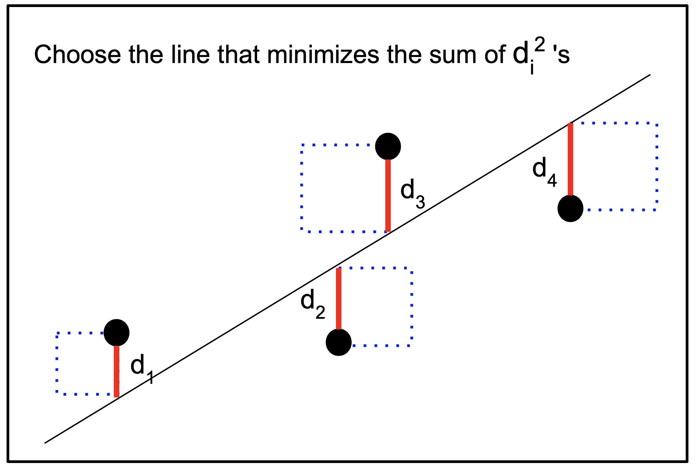

# STAT 131A, Fall 2024: Homework 3 Coding Questions

## Confidence interval

Use this space to write any code you used for the confidence interval question from the math problems.

```{r}
# Your code here!

```

## Hypothesis test

Use this space to write any code you used for the hypothesis test question from the math problems.

```{r}
# Your code here!

```

## Power

Use this space to write any code you used for the power calculation from the math problems.

```{r}
# Your code here!

```

## 🩸 Blood glucose and the bootstrap

This question continues from the end of Lab 4b.

## ✅ Setup and data import

In this HW, we will work with blood glucose data from 100 patients with diabetes. The data are derived from [public datasets](https://public.jaeb.org/datasets/diabetes) provided by the Jaeb Center for Health Research.

Make sure to run the cell below before getting started.

```{r}
# Load in additional functions
library(tidyverse)
library(lubridate)

# Use three digits past the decimal point
options(digits = 3)

# Format plots with a white background and dark features.
theme_set(theme_bw())

# Load in the data
data = read_csv("https://jdgrossman.com/assets/hba1c-cgm-data.csv")

head(data)
```

## 🩸 Background info on blood glucose, HbA1c, and CGMs

[Diabetes mellitus](https://en.wikipedia.org/wiki/Diabetes) is a group of diseases characterized by an inability of the body to properly maintain healthy blood glucose levels.

-   Having high blood glucose for long periods of time can lead to [serious health complications](https://www.cdc.gov/diabetes/managing/problems.html), such as nerve damage and heart disease.

The [glycated hemoglobin (HbA1c)](https://en.wikipedia.org/wiki/Glycated_hemoglobin) test was introduced in the late 1970s as a way to monitor long-term trends in blood glucose levels.

-   HbA1c values above 6.4% are typically indicative of diabetes. Values above 7% are associated with long-term complications, with higher values associated with more severe complications.

-   Patients with diabetes are typically instructed to have their blood drawn every three months to monitor their HbA1c.

[Continuous glucose monitors (CGMs)](https://en.wikipedia.org/wiki/Continuous_glucose_monitor) allow patients with diabetes to see a real-time output of their blood glucose levels.

-   The picture at the top of this lab is an example of a CGM.

-   The first CGM was introduced in 1999, but CGM adoption did not begin to accelerate until about 10 years later.

-   Thus, HbA1c measurement is still the gold standard for predicting long-term health outcomes in patients with diabetes, as there simply has not been as much time for CGM measurements to be formally correlated with longer-term health outcomes.

> To see Josh's current CGM output, visit [this website](https://jgrossman-new.herokuapp.com).

In a later lab, we will assess the relationship between CGM output and HbA1c among a sample of 100 patients with diabetes. In this lab, you will begin working the same dataset. For each patient, you have the following data:

1.  `a1c_value`: An HbA1c measurement. HbA1c is often abbreviated as A1c.
2.  `mean_bg`: The patient's CGM-measured average blood glucose (BG) in the several weeks or months before their HbA1c was measured.
3.  `time_in_range`: The proportion of CGM blood glucose measurements that were in the healthy range of 70 mg/dL to 180 mg/dL. Often abbreviated as TIR.

For the purposes of this assignment, you can assume that the 100 patients in the data were randomly drawn from the same population.

### 🚀 Exercise 1

Make two professionally-formatted scatterplots with the following characteristics:

-   Each point on your plot should represent one patient.

-   Both plots should have HbA1c on the y-axis.

-   The first plot should have mean blood glucose on the x-axis.

-   The second plot should have time in range on the x-axis.

-   The axis labels should indicate the units of each measurement. Make sure to read the background information above to identify the units.

Then, in 1-2 sentences, describe any patterns you observe in your plots.

```{r}
# Your code and written answer as a code comment here!

```

### 🎶 Interlude: Lines of best fit

Using a pencil, you could likely draw a [line of best fit](https://en.wiktionary.org/wiki/line_of_best_fit) on the plots above.

-   But, how could we mathematically define the best-fitting line?

One common approach is to minimize the sum of squared vertical distances from each point to the line.

-   In other words, we want to choose the slope and intercept values that minimize the total area of all of the dotted squares (see below!)

🖼️ Here's a picture:



The equation for our line of best fit is $\hat{y} = \text{intercept} + \text{slope} * x$.

-   $\hat{y}$ is the **predicted** HbA1c value for a given patient, and $x$ is the patient's mean blood glucose or time in range.

-   Our equation looks just like $y = mx + b$, the equation for a line from algebra class. Statisticians tend to use the equation $y = a + bx$ for 2D lines of best fit. Note that $b$ is the slope of the second equation, and not the intercept!

Following the picture above, our objective is to minimize the following expression:

$$ \sum_{i=1}^n \left(y_i - \hat{y}_i \right)^2, $$ where $n$ is the number of patients, $\hat{y}_i$ is the **predicted** HbA1c value for patient $i$, and $y_i$ is the **actual** HbA1c value for patient $i$.

-   $\left(y_i - \hat{y}_i \right)^2$ represents the area of the dotted square for patient $i$.

-   The predicted HbA1c is given by the line of best fit, $\hat{y}_i = \text{intercept} + \text{slope} * x_i$.

Putting it all together, we want to identify the **slope** and **intercept** that minimize the sum of squared differences written above. We can concisely write this objective as follows:

$$ \underset{\text{slope}, \text{intercept}}{\mathrm{arg\,min}} \sum_{i=1}^n \left(y_i - (\text{intercept} + \text{slope}*x_i \right)^2$$

By taking [partial derivatives](https://en.wikipedia.org/wiki/Partial_derivative) with respect to the $\text{slope}$ and $\text{intercept}$ parameters, we can show that the following formulas provide the optimal slope and intercept:

$$ \text{slope}_\text{optimal} = \frac{\sum_{i=1}^n (x_i - \bar{x})(y_i - \bar{y})}{\sum_{i=1}^n (x_i - \bar{x})^2} $$

$$ \text{intercept}_\text{optimal} = \bar{y} - \text{slope}_\text{optimal} * \bar{x} $$

If you have not taken multivariable calculus, you probably have not seen the term "partial derivative" before. But, that's okay! You will not need to take partial derivatives in 131A.

-   Regardless of your math background, it's critical to understand **why** we have the formulas above: These equations minimize the sum of squared vertical distances (i.e., the sum of squared residuals) from each point to the line.

### 🚀 Exercise 2

Write a function `get_optimal_slope` to compute the optimal slope parameter given inputted data.

-   Your function should implement the formula for $\text{slope}_\text{optimal}$ given above.

-   Your function should take two arguments: a vector of $x$ values and a vector of $y$ values.

-   You should assume that the $x$ and $y$ values are in the same order. In other words, the $i^\text{th}$ element of the $x$ vector and the $i^\text{th}$ element of the $y$ vector both belong to the $i^\text{th}$ patient.

Then, using your function, print the optimal slope for each the two plots from Exercise 1.

-   You are welcome to use an outside function like `lm` to confirm your answer, but you must implement the formula by hand.

```{r}
# Your code and printed output here!

# Some starter code to think about vector operations in R:
x = c(1,2,3,4,5)
m = mean(x)
x_diff = x - m
print(x_diff)
print(x * x_diff)
print(x_diff^2)

```

### 🚀 Exercise 3

Repeat Exercise 2, but this time write a function `get_optimal_intercept` to compute the optimal intercept parameter given inputted data.

-   Your answer should call the `get_optimal_slope` function you wrote in Exercise 2.

```{r}
# Your code and printed output here!


```

### 🚀 Exercise 4

Imagine that we had sampled a different random set of 100 patients from the same population. How much would we expect the optimal slope and intercept to deviate from sample to sample?

-   Using your `get_optimal_slope` function from above, run the bootstrap method with `B=10000` to estimate the standard error of the optimal slope.

-   Remember the key steps of the bootstrap: Generate `B` synthetic samples, and then use these samples to generate `B` synthetic point estimates. These `B` synthetic point estimates form the synthetic sampling distribution.

-   While you could technically use your `get_boot_se` function from Lab 4, you may find it easier to write fresh code with the `replicate` function.

-   To generate a single bootstrap resample, you might find it helpful to resample with replacement from `1:100`, and then use your random resample to index your `x` and `y` vectors.

-   For example, `x[idx]` will select the elements of `x` at the positions given by `idx`. `idx` can have repeated values!

-   There are lots of ways to do this question correctly. Try not to lean too heavily on PingPong to do the code planning for you.

How does your standard error compare to the standard error of the slope provided by `summary(lm(...))`?

-   Write your answer as code comment.

```{r}
# Your code and code comment here!

# Some starter code for inspiration:
x = c("a", "b", "c")
y = c("d", "e", "f")
idx = c(1,2,3,1,2)
x[idx]
y[idx]

```

### 🚀 Exercise 5

Repeat Exercise 4, but for the intercept term.

```{r}
# Your code and code comment here!

```
