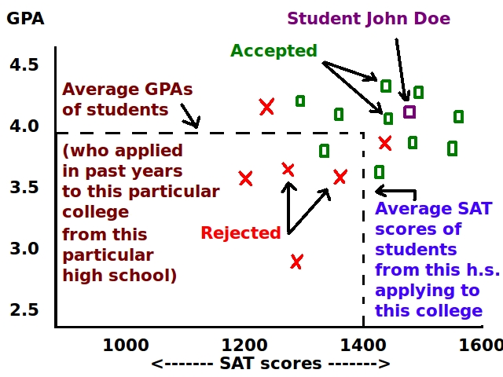

# STAT 131A, Fall 2024: Homework 4 Coding Questions

{width="300"}

There are two parts to HW4.

1.  In the first part of HW4, we will tackle an inference problem.

    -   We will use anonymized, school-level data to estimate the effect of adopting Naviance on undermatching.

    -   The data is provided by the authors of the paper we discussed in the first lecture of STAT 131A.

2.  In the second part of HW4, we will address a prediction problem, and also do a little bit of inference.

    -   Similar to HW3, we will work with blood glucose data.

    -   This time, we will use an expanded dataset that includes many additional features.

    -   We will try to fit the best linear model to predict HbA1c test results from continuous glucose monitor (CGM) data.

    -   As before, the data are derived from [public datasets](https://public.jaeb.org/datasets/diabetes) provided by the Jaeb Center for Health Research.

## ✅ Setup and data import

Make sure to run the cell below before getting started.

```{r}
# Load in additional functions
library(tidyverse)
library(lubridate)

# Use three digits past the decimal point
options(digits = 3)

# Don't use scientific notation
options(scipen = 999)

# Format plots with a white background and dark features.
theme_set(theme_bw())

# Load in the data
naviance_data = read_csv('data/naviance_data.csv')
a1c_train = read_csv('data/a1c_train.csv')

head(naviance_data)
head(a1c_train)
```

## 🏫 Part 1: Inference with Naviance and undermatching data

**For appropriate context, be sure to review the Naviance slides from Lecture 1.**

The Naviance data has the following columns:

1.  `id`: A unique ID for each high school in the dataset.
2.  `year`: The year.
3.  `undermatch_rate`: The undermatching rate at the high school in the given year.
4.  `access_to_naviance`: A boolean variable indicating whether the high school provided its students access to Naviance in the given year.

### 🚀 Part 1, Exercise 1

Fit a linear model that estimates, by year, the average undermatching rate across the entire dataset.

-   Print a summary of your model.

-   Your model should have one coefficient for each year represented in the dataset.

-   Even though the size of the high school student bodies may differ, it's OK that each high school is given equal weight in your average.

-   In a one-sentence code comment, interpret the intercept of your model.

```{r}
# Your code and code comment here!

```

### 🚀 Part 1, Exercise 2 (OPTIONAL, 3 POINTS OF EXTRA CREDIT)

First, use the `tidy` function from the `broom` package to extract the summary of your model as a dataframe.

-   Then, using your extracted dataframe, **plot the average undermatching rate for each year**, with the average rate on the y-axis and the year on the x-axis.

-   You should clean up the coefficient names that correspond to each year. For example, you could use `case_when` inside of `mutate`. Here's an example:

```         
# This code creates a new column called `new_column_name`.
# The new column takes on the value 'Year 1' wherever
# the old column is equal to 1, 'Year 2' wherever the old column
# is equal to 2, and 'Year 3' wherever the old column is equal to 3.
mutate(
  new_column_name = case_when(
    old_column_name == 1 ~ 'Year 1',
    old_column_name == 2 ~ 'Year 2',
    old_column_name == 3 ~ 'Year 3',
  )
)
```

-   Your plot should include, for each year, an **80% confidence interval of the true average undermatching rate**.

-   To plot the confidence intervals, you should use `geom_errorbar`. You will need to specify the `ymin` and `ymax` aesthetics.

-   Make sure to professionally format your plot.

-   Your plotting code should not contain any hard-coded numbers, except for the calculation of the critical statistic for the confidence intervals.

-   **Do you notice any patterns in your plot? If so, what could be responsible?** Answer in a code comment. This code comment is graded on thoughtfulness, not correctness.

> The plot you produce in this problem has been referred to as the ["secret weapon"](https://statmodeling.stat.columbia.edu/2005/03/07/the_secret_weap/)
>
> "We call this technique the “secret weapon” because it seems to be done much less often than it could be. I suspect the technique is not used more because people are fixated on point estimates and don’t realize that a graph can tell a clearer story." - Andrew Gelman

```{r}
# Your code and code comment here!

```

### 🎶 Interlude: Being scrappy with anonymous data

One of the fun parts of being a data scientist is figuring out how to augment a limited dataset with clever hacks.

In the Naviance data, we are not provided the number of college applicants at each high school.

-   Is there any way for us to sneakily infer the number of applicants at some of the high schools?

Suppose there was only one applicant recorded at a particular high school.

-   In this case, the only possible undermatching rate is 0 or 1.

-   If there were two students at a high school, the possible undermatching rates are 0, 0.5, and 1.

-   If there were three students, the possible rates are 0, 0.333, 0.666, and 1.

If we convert the observed undermatching rate into an approximate fraction, we can use the denominator as a proxy for **minimum** possible number of students at the high school.

-   For example, if the reported undermatching rate is 0.11111, we could convert it to an approximate fraction of 1/9. There must be at least 9 students at the high school.

-   Of course, there could have been 18 students, where 2 of them undermatched, but we cannot be sure. This is why the denominator is the **minimum** possible number of students.

The `MASS` package includes a function called `fractions` that converts a decimal representation to an approximate fraction, if one exists:

```{r}
# If you get an error in this cell, run install.packages('MASS')

# This notation tells R to use the `fractions` function from the `MASS` package, without loading in the full MASS package.
MASS::fractions(0.111111)
```

Let's use the `fractions` function to convert the undermatching rate at each high school to an approximate fraction, and then store these fractions in a new column called `approximate_frac`:

```{r}
new_naviance_data = naviance_data %>% 
  mutate(
    approximate_frac = as.character(MASS::fractions(undermatch_rate)),
    
    # This grabs the denominator from the approximate fraction.
    # Don't worry about the details of this code.
    denominator = as.numeric(str_extract(approximate_frac, '\\d+$'))
  )

new_naviance_data
```

### 🚀 Part 1, Exercise 3

Consider the high schools with a **minimum of 20 recorded applicants for at least one year**, and who have **six years** of recorded data.

Among these high schools, identify the two high schools with **exactly two years of Naviance access**.

-   **Print the IDs of these two high schools.**

You may need to modify `new_naviance_data` to help you with your search.

-   For example, you might add a new column that indicates the number of years the high school provided Naviance to its students, and then use `filter` based on the value of this column.

-   While you can run `View(name_of_dataframe)` to comb through a dataframe manually, **you must identify the two schools with `R` code**.

```{r}
# Your code here!


```

### 🚀 Part 1, Exercise 4

For each of the two high schools you identified, plot the undermatching rate as a function of the year.

-   Draw a vertical line at the first year the school adopted Naviance. You can use `geom_vline` for this, and specify the `xintercept` aesthetic.

-   Make sure to professionally format your plots.

-   Based on your two plots, does it look like Naviance adoption may have affected the likelihood of undermatching at these schools? Answer in a code comment.

```{r}
# Your code and code comment here!

```

### 🚀 Part 1, Exercise 5

Using the full Naviance dataset, fit a linear regression model predicting the undermatching rate from the high school ID and Naviance access.

-   Print the summary of the model.

```{r}
# Your code here!

```

### 🚀 Part 1, Exercise 6

Answer the following questions:

1.  What is the interpretation of the `(Intercept)` coefficient of your model in Exercise 5?

2.  What is the interpretation of the `access_to_navianceTRUE` coefficient of your model in Exercise 5?

3.  Does your model provide statistically significant evidence that Naviance adoption may have increased the likelihood of undermatching? Why or why not?

4.  How does your model relate to the geometry of the plots you produced in Exercise 4?

    -   You may find it helpful to refer to Figure 3 of this [research paper](https://5harad.com/papers/undermatching.pdf) for inspiration.

Answer in code comments.

```{r}
# Your answers here!

```

### 🚀 Part 1, Exercise 7 (OPTIONAL, 5 POINTS OF EXTRA CREDIT)

> This question is courtesy of Van. Be sure to thank your [friendly neighborhood](https://www.tiktok.com/@paramountplusaustralia/video/7267059369408335137?lang=en) TA for the extra credit opportunity!

#### Exercise 7a (OPTIONAL)

Fit a linear model predicting the undermatching rate from Naviance access alone.

-   Then, perform a t-test on the difference of means between all schools with Naviance and all schools without Naviance, making sure to print the corresponding 95% confidence interval.

-   Consider the `access_to_navianceTRUE` coefficient of your fit linear model and its corresponding standard error. Can you derive them from the t-test confidence interval? Explain.

    -   *Hint: How do we extract point estimates and standard errors from normally-approximated confidence intervals?*

```{r}
# Your code here!

```

#### Exercise 7b (OPTIONAL)

Fit a linear model predicting the undermatching rate from school ID alone.

-   Compute the residuals of this model. Store the residuals in a column of `naviance_df`.

    -   Recall that a residual is the difference between the true outcome value and its corresponding predicted value.

-   Perform a two sample t-test for the difference in means of the **residuals** for schools with access to Naviance and schools without Naviance access.

-   Why is the t-test statistically significant now, but not in Exercise 7a?

    -   *Hint: Do all high schools have the same baseline rate of undermatching? The plot from your HW1 plot presentation may provide some guidance. You should also notice that the point estimate of the t-test is close to the `access_to_navianceTRUE` coefficient from Exercise 7a.*

```{r}
# Your code here!

```

## Part 2: Prediction with CGM and HbA1c data

## 🩸 Background info on blood glucose, HbA1c, and CGMs

> FYI, this is the same background info from previous labs and HW assignments.

[Diabetes mellitus](https://en.wikipedia.org/wiki/Diabetes) is a group of diseases characterized by an inability of the body to properly maintain healthy blood glucose levels.

-   Having high blood glucose for long periods of time can lead to [serious health complications](https://www.cdc.gov/diabetes/managing/problems.html), such as nerve damage and heart disease.

The [glycated hemoglobin (HbA1c)](https://en.wikipedia.org/wiki/Glycated_hemoglobin) test was introduced in the late 1970s as a way to monitor long-term trends in blood glucose levels.

-   HbA1c values above 6.4% are typically indicative of diabetes. Values above 7% are associated with long-term complications, with higher values associated with more severe complications.

-   Patients with diabetes are typically instructed to have their blood drawn every three months to monitor their HbA1c.

[Continuous glucose monitors (CGMs)](https://en.wikipedia.org/wiki/Continuous_glucose_monitor) allow patients with diabetes to see a real-time output of their blood glucose levels.

-   The first CGM was introduced in 1999, but CGM adoption did not begin to accelerate until about 10 years later.

-   Thus, HbA1c measurement is still the gold standard for predicting long-term health outcomes in patients with diabetes, as there simply has not been as much time for CGM measurements to be formally correlated with longer-term health outcomes.

> To see Josh's current CGM output, visit [this website](https://jgrossman-new.herokuapp.com).

## 🩸 Predictions with blood glucose and HbA1c

For each observation in `a1c_train`, you have the following data:

1.  `a1c_value`: An HbA1c measurement. HbA1c is often abbreviated as A1c.
2.  `mean_bg`: The patient's CGM-measured average blood glucose (BG) in the several weeks or months before their HbA1c was measured.
3.  `sex` and `race`
4.  Many additional features of the CGM data, such as the standard deviation of blood glucose values during the night.

```{r}
head(a1c_train)
```

### 🚀 Part 2, Exercise 1

Fit a linear model to determine whether there is a statistically significant difference in the average HbA1c of patients **across race**.

-   Print the summary of your model, and explain whether the model results provide evidence of a difference.

-   What might be responsible for your result? This answer is graded on thoughtfulness, not correctness. Answer in a code comment.

```{r}
# Your code and code comment here!


```

### 🚀 Part 2, Exercise 2

Fit a linear model to determine whether there is a statistically significant difference in the linear relationship between HbA1c and mean blood glucose **across sex**.

-   Print the summary of your model.

-   Interpret each coefficient of your model. Write one sentence per coefficient.

-   Explain why your model does or does not provide evidence of sex-specific differences in the linear relationship of HbA1c and mean blood glucose.

```{r}
# Your code here!

```

### 🚀 Part 3, Exercise 3

Fit a linear model to predict `a1c_value` using all the features in the `a1c_train` data.

-   To fit a linear model with all features in a dataframe named `df`, you can use `lm(a1c_value ~ ., data=df)`.

-   Compute and print the in-sample RMSE this **fully-saturated** model.

    -   To check your answer, you may recall that a close approximation to the in-sample RMSE is hiding in the summary output of the model!

-   Make sure to write and use a helper function called `get_rmse` that computes the RMSE from a vector of real outcomes called `real`, and a vector of predicted values called `preds`. You will use this function several times in later exercises.

-   What is the plain-language interpretation of the RMSE? Answer in a code comment.

```{r}
# Your code here!

```

### 🚀 Part 2, Exercise 4

Using five-fold cross-validation (CV), **estimate** the out-of-sample RMSE of the model from Exercise 3.

-   Do not use an external package to run cross-validation. You must code it up manually. *FYI: Coding up CV is a common interview question.*

```{r}
# Your code here!

```

### 🚀 Part 2, Exercise 5

Compute the **actual** out-of-sample RMSE on the held-out `a1c_test` data, which is loaded below.

-   The test data consists of the final recording of HbA1c for all patients in this study.

-   Some patients only had one recorded HbA1c, so these patients are only in the test set.

-   So, the training data is not fully representative of all patients! Keep this in mind when you are interpreting your results.

```{r}
# Your code here!

a1c_test = read_csv('data/a1c_test.csv')

```

### 🚀 Part 2, Exercise 6

Consider the three RMSE values from Exercises 3, 4, and 5. Answer each of the following questions in a code comment.

-   Why is the out-of-sample RMSE higher than the in-sample RMSE?

-   Why is the CV-estimated RMSE closer to the in-sample RMSE than the out-of-sample RMSE?

```{r}
# Your code here!


```

### 🚀 Part 2, Exercise 7

Compute the in-sample RMSE and out-of-sample RMSE of your model from Exercise 2.

-   How does the in-sample RMSE from this exercise compare to the in-sample RMSE of the model you fit in Exercise 3? What about the out-of-sample RMSE?

-   What might explain the differences? Answer in a code comment.

```{r}
# Your code and code comment here!

```

### 🚀 Part 2, Exercise 8

Fit a linear model to predict `a1c_value` using all the features in the `a1c_train` data **interacted with all other features**.

-   To fit a linear model with the interactions between all features in a dataframe named `df`, you can use `lm(a1c_value ~ .*., data=df)`.

    -   If you print the summary of this model, you'll see that there are **a lot** of coefficients.

-   Compute the in-sample RMSE and out-of-sample RMSE of this fully-interacted model.

-   How does the in-sample RMSE from this exercise compare to the in-sample RMSE of the **fully-saturated** model from Exercise 3? What about the out-of-sample RMSE?

-   What might explain any differences? Answer in a code comment.

```{r}
# Your code and code comment here!

```
