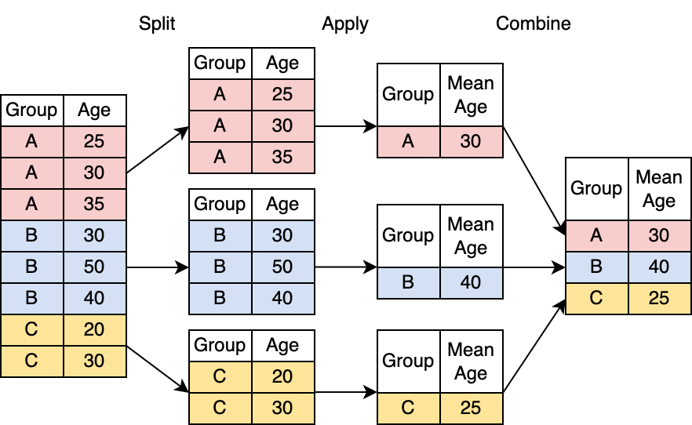

# 🛑 Analyzing NYPD stop-and-frisk data with `R`

**Due Date**: Monday September 9th at midnight (i.e., one minute after 11:59pm)

Labs are submitted via Gradescope.

-   You will submit both (1) a .Rmd file with your code and (2) an HTML file containing the code and output.
-   You can generate an HTML file in RStudio by pressing `Knit` and then `Knit to HTML`.
-   The knitting process will not work if there are errors in your code, so be sure to leave plenty of time to knit your lab notebooks before the deadline.

## Introduction

In this lab, we'll use `R` to examine stop-and-frisk practices in New York City.

> **Important note**: Policing can be a sensitive subject. It's important to remember that each row in our data represents a real interaction between a police officer and stopped individual. Please keep this in mind as you work through the tutorial, and be sure to engage with the material to the extent you're comfortable.

By the end of the lab, you'll have foundational understanding of the following:

1.  📊 How to use `R` to explore tabular data and calculate descriptive statistics.
2.  📈 How to make an informative plot with `R`
3.  ⚖️ How to approach questions about social policy with data.

## ✅ Set up

While the core `R` language contains many useful functions (e.g., `sum` and `sample`), there is vast functionality built on top of `R` by community members.

Make sure to run the cell below. It imports additional useful functions, adjusts `R` settings, and loads in data.

```{r}
# Load in additional functions
library(tidyverse)
library(lubridate)

# Use three digits past the decimal point
options(digits = 3)

# Format plots with a white background and dark features.
theme_set(theme_bw())

# This is where the data is stored.
STOPS_PATH = "data/nyc_stops.rds"

# Read in the data
stops = read_rds(STOPS_PATH)

```

## Part 1: Data manipulation with `dplyr`

### 🖼️ The data frame

Data frames are like spreadsheets in Microsoft Excel or Google Sheets: they have rows and columns, and each cell in the spreadsheet contains data.

Run the cell below to preview the `stops` data. What do you notice?

> 🔎 The `head` function allows us to see the first couple rows of a dataframe.

> A tibble is a data frame with some extra features. For the purposes of this class, you can think of them as the same thing.

```{r}
head(stops)
```

⬆️ From the preview above, it appears that each row in the `stops` dataframe represents a stop, and each column contains information about each stop.

### 💭 Asking questions about the data

As an analyst, you might start with the following questions:

1.  How many stops (i.e., rows) are in the `stops` data?
2.  What do we know about each stop?
3.  When was the earliest stop?
4.  What were the most commons reasons for stops?
5.  Who is most likely to get stopped?

Let's start with the first question: how many rows are in the `stops` data?

```{r}
# nrow --> Number of rows
nrow(stops)
```

Looks like we have information on approximately 2.2 million stops.

What do we know about each stop?

```{r}
# colnames --> Names of columns
colnames(stops)
```

It looks like we have the basics of each stop: whether a frisked occurred, the reason(s) for the stop, and demographics.

## 🚀 Exercise: Stop dates

When did the stops in the `stops` data occur?

-   You will want to inspect the `date` column in the `stops` data to get a sense of when stops typically occur.

A few pointers:

-   💵 To extract a column from a data frame, use the `$` symbol. For example, to retrieve column `age` from data frame `df`, we write `df$age`.

-   You may find the following functions helpful: `sample`, `min`, `max`, `range`, and `print`. You can learn more about a function `f` by running `?f`.

```{r}
# Your code here!

```

## 🚰 The pipe: `%>%`

All three of these lines of code do exactly the same thing:

```{r}
# Method 1
print(nrow(stops))

# Method 2
stops %>% 
    nrow() %>%
    print()

# Method 3
stops |> 
    nrow() |>
    print()
```

Why should we care? Read on to find out!

### The math of the pipe: `%>%` and `|>`

To process a dataset, we may have to use several functions. For example, we may want to use function `a`, then function `b`, and finally function `c`:

```         
c(b(a(data)))
```

To understand what this code is doing, we have to read the code ⏪inside out⏩: we start with `a`, then apply `b`, then apply `c`.

🙀 If we start adding more functions, things gets messy:

```         
f(e(d(c(b(a(data))))))
```

The pipe (`%>%` or `|>`) allows us to turn our code inside out. This makes our code read more like a sentence:

```         
data %>% a() %>% b() %>% c() %>% d() %>% e() %>% f()
```

More readably:

```         
data %>%
    a() %>%
    b() %>%
    c() %>%
    d() %>%
    e() %>%
    f()
```

The code above starts with the data itself, applies the function `a`, then `b`, then `c`, and so on.

> Recently, `R` introduced the `|>` operator, which behaves very similarly to `%>%`. For this class, you can use them interchangeably. You may see both in this class.

The pipe pushes (i.e., pipes!) what's on the left of the pipe `%>%` into the first argument of the function on the right:

```         
x %>% f() == f(x)

x %>% f(y) == f(x, y)

x %>% f(y, z) == f(x, y, z)
```

The pipe `%>%` really ☀️shines☀️ when you have a lot of data manipulation steps!

## 📝 Adding new columns with `mutate`

Our data extends from 2008 to 2011. Suppose want to examine the most recent year of data: 2011.

Problem: We don't have a `year` column. To add new columns, we use `mutate`.

🖥️ Usage: `mutate(data, new_col = f(existing_col))`

-   `data`: the data frame
-   `new_col`: name of the new column to add
-   `f`: function to apply to existing column(s) to generate the new column
-   `existing_col`: name of existing column

For example, here's how we could add a column to `stops` that indicates the day of the week.

```{r}
# Run this cell, and then scroll all the way to right of the 
# dataframe to see the new `day_of_week` column
stops %>%
    mutate(
      day_of_week = wday(date, label=TRUE)
    ) %>%
    head()
```

❗❗❗Important note❗❗❗: Most `R` functions are "copy on modify". In other words, when we apply a function to data, `R` creates a copy of the data and then modifies the copy. The original data is unchanged.

So, using `mutate` **will not change** the original data. It creates a new modified copy of the data.

### 🚀 Exercise

1.  Use `year()` and `mutate()` to add a new column called `yr` to our `stops` data.

> You can read about the `year()` function by running `?year`.

> There are other date- and time-related functions like `month()` and `day()` in the `lubridate` `R` package.

2.  Assign the resulting data frame to a new variable called `stops_w_yr`.

3.  Finally, run `count(stops_w_yr, yr)`.

> What do you think `count` does? Do you notice any patterns?

```{r}
# Your code here!

```

## 📝 Selecting rows with `filter`

Now that we have a `yr` column, we want to limit our data to just the stops in 2011.

Problem: We have data from 2008 to 2011. To limit to specific rows, we use `filter`.

🖥️ Usage: `filter(data, condition)`

-   `data`: the data frame
-   `condition` : a boolean vector where TRUE indicates the rows in `data` to keep.

For example, here's how we could limit `stops` to just Precinct 42:

```{r}
stops %>%
    filter(
      precinct == 42
    ) %>%
    head()
```

### 🚀 Exercise

How many stops occurred in 2011 among Hispanic female individuals between 6pm and 11pm?

> You may find the operators `&`, `|`, `<=`, `<`, `>`, or `>=` helpful.

```{r}
# Your code here!

```

## 📝 Aggregating data with `summarize()`

What was the average, median, maximum, and minimum number of stop reasons?

Problem: We want to aggregate the values in the `n_stop_reasons` column. To do this, we use `summarize()`.

```{r}
# Old method.
mean(stops$n_stop_reasons)
median(stops$n_stop_reasons)
max(stops$n_stop_reasons)
min(stops$n_stop_reasons)

# New method!
stops %>%
    summarize(
        mean_n_reasons = mean(n_stop_reasons),
        median_n_reasons = median(n_stop_reasons),
        max_n_reasons = max(n_stop_reasons),
        min_n_reasons = min(n_stop_reasons)
    )
```

Neat! But, it's not groundbreaking. `summarize()` really ☀️ shines ☀️ when used with `group_by()`.

## 📝 Getting powerful with `group_by()` and `summarize()`

Here's where things get really interesting. The techniques in this section account for a **huge** chunk of most data science workflows.

> ❗❗❗ Make sure to read the sentence above! This section is especially important to your development as a data scientist!

Suppose I'm interested in the average number of stop reasons in each police precinct (i.e., patrol area) in NYC.

> `unique(v)` returns the set of unique values in a vector `v`

> `sort(v)` sorts a vector `v` in numeric or alphabetical order.

```{r}
# What are the different precincts?
sort(unique(stops$precinct))

# Alternatively
stops %>% pull(precinct) %>% unique %>% sort
```

You already have the tools to find the average number of stop reasons by precinct!

Looks a little scary though...

```{r}
stops %>% filter(precinct==1) %>% pull(n_stop_reasons) %>% mean(na.rm=TRUE)
stops %>% filter(precinct==2) %>% pull(n_stop_reasons) %>% mean(na.rm=TRUE)
stops %>% filter(precinct==3) %>% pull(n_stop_reasons) %>% mean(na.rm=TRUE)
stops %>% filter(precinct==4) %>% pull(n_stop_reasons) %>% mean(na.rm=TRUE)
stops %>% filter(precinct==5) %>% pull(n_stop_reasons) %>% mean(na.rm=TRUE)
stops %>% filter(precinct==6) %>% pull(n_stop_reasons) %>% mean(na.rm=TRUE)
# ...
```

We can get the answer with brute force, but we have some issues:

-   We had to write a lot of repeated code.
-   What if there were 1,000 precincts? Or 1,000,000 precincts?
-   The results aren't labeled. We'd have to write even more code to label the output.

Here's another way to answer the question, but with less code:

```{r}
stops %>%
    group_by(precinct) %>%
    summarize(
      avg_n_reasons = mean(n_stop_reasons, na.rm=TRUE)
    )
```

The next section will explain the magic of grouping.

### 📝 The mechanics of `group_by()`

It's **very** common to calculate an aggregate statistic (e.g., `sum` or `mean`) for different groups (e.g., precinct or year).

The *split-apply-combine* paradigm handles these situations:

-   **Split** the data by group into mini-datasets
-   **Apply** a function to each mini-dataset
-   **Combine** the mini-datasets back together

🖼️ A visual:

\

### 📝 Splitting with `group_by`

`group_by` handles the *splitting* step.

Problem: The data isn't grouped. To split the data, we use `group_by`.

🖥️ Usage: `group_by(data, column)`

-   `data`: the data frame
-   `column`: the name of the column to group by.

Let's try grouping the `stops` data by precinct.

```{r}
stops_grouped = stops %>%
    group_by(precinct)

head(stops_grouped)
```

Wait a second. This looks exactly the same as the regular data:

```{r}
head(stops)
```

❗❗Important note❗❗: `group_by` doesn't actually change the underlying data. It invisibly groups the data in the background.

> There is a subtle indication that the data is grouped. If you look at the top of the grouped data frame, you'll see the word `Groups: precinct [6]`. At the top of the ungrouped data, there is no such label.

#### 📝 Applying and combining with `summarize()`

`summarize()` *applies* an aggregating function to each mini-dataset. It then *combines* the mini-datasets.

We've already seen `summarize()` in action:

```{r}
stops %>%
    summarize(
        avg_n_reasons = mean(n_stop_reasons, na.rm=TRUE),

        # The n() function counts the number of rows.
        # n() can only be used inside of dplyr functions like mutate() and summarize()
        n_stops = n()
    )
```

Let's try `summarize()` with grouped data.

> We can also calculate the size of each group with the `n()` function.

```{r}
stops %>%
    group_by(precinct) %>%
    summarize(
        avg_n_reasons = mean(n_stop_reasons, na.rm=TRUE),
        num_stops_in_precinct = n()
    )
```

That's all there is to it!

### 🚀 Exercise

1.  Use `group_by()` and `summarize()` to calculate the following statistics for each stop location (`location_housing`):

    (a) the number of stops

    (b) the proportion of stops that resulted in a frisk

    (c) the proportion of **frisks** (not stops!) that resulted in a weapon found

    What can you conclude from the results?

> Keep in mind that weapons can technically be detected without a frisk (e.g., from plain view). Make sure only to count weapons recovered from frisks.

2.  Redo question 1, but group by race instead of location. What do you conclude from the result?

3.  Redo question 1, but group by location **and** race. What is your interpretation of the results?

```{r}
# Your code for Exercise 1 here!

```

```{r}
# Your code for Exercise 2 here!

```

```{r}
# Your code for Exercise 3 here!

```

### Concluding remarks on Part 1

The method used in the final exercise is called an **outcome test**.

## Part 2: Visualizing data with `ggplot2`

### 📊 Why do we need plots?

In Part 1, we learned to use the `group_by()` and `summarize()` functions.

For example, we can calculate the frisk rate by location.

```{r}
frisk_rate_by_location = stops %>%
  group_by(location_housing) %>% 
  summarize(
    n_stops = n(),
    frisk_rate = mean(frisked)
  )

frisk_rate_by_location
```

As we found above, frisk rates were lowest in housing settings.

Let's try something similar: calculate the frisk rate by location **and** hour.

```{r}
frisk_rate_by_location_and_hour = stops %>%
  group_by(location_housing, hour) %>% 
  summarize(
    n_stops = n(),
    frisk_rate = mean(frisked)
  )

frisk_rate_by_location_and_hour
```

It would take a long time to discover any meaningful patterns from this table.

With a plot, patterns can emerge almost instantly. Try running the code below.

```{r}
ggplot(frisk_rate_by_location_and_hour, aes(x=hour, y=frisk_rate, color=location_housing)) +
    geom_line()
```

We can now easily see that frisks are least common around the start of the standard work day, and that they peak around midnight.

Plots reduce the **cognitive burden** of gleaning insights from text.

> According to a classic [research paper](https://brendans-island.com/blogsource/20170523-Documents/20170603-8611.pdf), humans can process images **60,000** times faster than text.

By the end of this tutorial, you'll be on your way to making clean and effective plots with `R`.

## ⚙️ The mechanics of `ggplot2`

`ggplot2` is a popular and flexible `R` package for plotting.

To make a basic plot, this all you have to tell `ggplot2`:

-   What data should be used?
-   What kind of plot would you like (e.g., bar chart, line graph, or histogram)?
-   Which columns should be plotted?

Let's see this in action using a dataset with the number of stops occurring in each month:

```{r}
n_stops_by_month = stops %>% 
  group_by(month) %>% 
  summarize(n_stops = n())

n_stops_by_month
```

`ggplot2` in action:

```{r}
# First argument: the data
# Second argument: the columns to plot on each axis
ggplot(n_stops_by_month, aes(x = month, y = n_stops)) + 

    # Here's where we specify the plot type
    geom_line() 
```

🛠️ Let's break down each piece:

1.  The `ggplot()` function **initializes** a blank plot.

2.  `n_stops_by_month` is our data.

3.  The `aes()` function makes a **mapping** between columns and **aesthetics** (i.e., features) of our plot.

4.  `aes(x = month, y = n_stops)` tells `ggplot2` that we should plot the `month` column on the x-axis, and the `n_stops` column on the y-axis.

5.  The addition (`+`) of `geom_line` tells `ggplot2` to construct a line graph using the `x` and `y` values we specified inside `aes()`.

❗❗Important note❗❗: `ggplot2` uses addition `+` instead of the pipe `%>%` to chain functions.

> 🏛️ This is for historical reasons: `ggplot2` was created before the pipe `%>%`!

We can also indicate `ggplot` arguments **by name** instead of **by position**. The code below produces the same plot as above.

```{r}
# `data` argument: the data
# `mapping` argument: the mapping between aesthetics and columns in the data
ggplot(data = n_stops_by_month, mapping = aes(x = month, y = n_stops)) + 

    # Here's where we specify the plot type
    geom_line() 
```

You can also specify the `mapping` argument within a `geom_*` function. The code below produces the same plot as above.

```{r}
# `data` argument: the data
# `mapping` argument: the mapping between aesthetics and columns in the data
ggplot(data = n_stops_by_month) + 

    # Here's where we specify the plot type
    geom_line(mapping = aes(x = month, y = n_stops)) 
```

## 🚀 Exercise

1.  Modify the plotting code above to create a bar chart, a scatterplot, and a smoothed curve.

> You may find the functions `geom_col()`, `geom_point()`, and `geom_smooth()` helpful.

2.  Try adding more than one `geom_*` function to your code. What happens?

```{r}
# Your code for bar chart here!

```

```{r}
# Your code for scatterplot here!

```

```{r}
# Your code for multiple geom's here! 

```

## 🎨 Adding [c]{style="color: red;"}[o]{style="color: blue;"}[l]{style="color: green;"}[o]{style="color: orange;"}[r]{style="color: purple;"} to our plot

So far, we've used two columns from our data. So, our plots are 2-dimensional (2D).

How could we show data from more than one column?

-   Number of stops **by race** for each year
-   Number of stops **by gender** for each year
-   Number of stops **by age** for each year

One option is a [3D plot](https://c3d.libretexts.org/CalcPlot3D/index.html). They exist, but they can be hard to read, and hard to generate.

> 📰 For example, how would you put a 3D plot on the cover of the New York Times?

How can we add dimensions while keeping our plot 2D? ☀[C]{style="color: red;"}[O]{style="color: blue;"}[L]{style="color: green;"}[O]{style="color: orange;"}[R]{style="color: purple;"} ☀️! Or anything else from this list:

-   〰️ Linetype (e.g., dotted or dashed)
-   📈 📉 Multiple 2D plots (i.e., **facets**)
-   ⚫ Point size
-   🟥 Point shape
-   And more!

Here's the example from earlier:

```{r}
# Change 1: New data. `n_stops_by_age_by_year` was the super long table.
# Change 2: We added `color = age_first_digit`.
ggplot(frisk_rate_by_location_and_hour, aes(x=hour, y=frisk_rate, color=location_housing)) +
    geom_line()
```

## 🚀 Exercise

1.  Modify the plotting code to create a [c]{style="color: red;"}[o]{style="color: blue;"}[l]{style="color: green;"}[o]{style="color: orange;"}[r]{style="color: purple;"}[e]{style="color: pink;"}[d]{style="color: brown;"} bar chart and scatterplot.

> Think about which type of plot is most informative, and which one is least informative.

2.  Instead of mapping `color` to `location_housing`, try the following mappings:

-   `linetype` to `location_housing`

-   `fill` to `location_housing`

Note: Some mappings may give you errors with certain `geom`'s. For example, does `linetype` make sense for a scatterplot?

3.  Make a line chart, but map `color` to `location_housing` **and** map `linetype` to `location_housing`. What happens?

```{r}
# Your code for Exercise 1 here!

```

```{r}
# Your code for Exercise 2 here! 

```

```{r}
# Your code for Exercise 3 here!

```

### Boxplots 📦

To make a boxplot with `ggplot2`, we use `geom_boxplot()`.

For example, we could make a boxplot of the total number of stops that occurred during all recorded days in the data.

```{r}
n_stops_by_day = stops %>%
    group_by(date) %>%
    summarize(n_stops = n())

head(n_stops_by_day)

ggplot(n_stops_by_day, aes(x=n_stops)) +
    geom_boxplot()
```

Since there is only one dimension to this data, we should remove the y-axis ticks and horizontal gridlines, which are good examples of "chart junk" for this plot!

-   We can also do some general clean up, like extending the x-axis to 0, and increasing the number of breaks.

```{r}
ggplot(n_stops_by_day, aes(x=n_stops)) +
  geom_boxplot() +
  
  # We do not expect you to memorize how to do minor formatting like the code below!
  # You should understand the big picture idea of how to pass in data to
  # ggplot, and how to map columns to aesthetics (x, y, color, shape, etc.).
  # Basically, you should understand how to write everything above this comment.
  # You can look up how to make additional modifications 
  # using Google or an LLM.
  scale_x_continuous(
    # Start the x-axis at 0, and let ggplot choose the upper boundary
    limits=c(0,NA),
    
    # Check out Lab 0 for more info about the seq() function.
    breaks=seq(0, 3000, by=500)
  ) +
  theme(
    axis.title.y=element_blank(),
    axis.text.y=element_blank(),
    axis.ticks.y=element_blank(),
    panel.grid.minor.y=element_blank(),
    panel.grid.major.y=element_blank(),
  )
```

We can also make paired boxplots.

For example, we might compare the daily stop distribution across days of the week.

```{r}
n_stops_by_day_of_week = stops %>%
    mutate(day_of_week = as.character(wday(date))) %>%
    group_by(date, day_of_week) %>%
    summarize(n_stops = n())

head(n_stops_by_day_of_week)

ggplot(n_stops_by_day_of_week, aes(x=day_of_week, y=n_stops)) +
    geom_boxplot()
```

**Note:** Take a look at the lecture code to see how to make additional boxplot modifications. You can also ask an LLM for help!

### Histograms 📊

To make a histogram with `ggplot2`, we use `geom_histogram()`.

For example, we can make a histogram of the daily stop count.

```{r}
ggplot(n_stops_by_day, aes(x=n_stops)) +
    geom_histogram()
```

Notice that `geom_histogram` automatically chooses the number of bins for us, and automatically counts up the number of observations in each bin.

> There is a [surprising amount of research](https://en.wikipedia.org/wiki/Histogram#Number_of_bins_and_width) about the best default number of bins.

To adjust the number of bins, we can use the `bins` argument.

```{r}
ggplot(n_stops_by_day, aes(x=n_stops)) +
    geom_histogram(bins=10)
```

`ggplot2` invisibly refers to the count in each bin as `..count..`.

> Notice how the code below produces exactly the same plot as the code above.

```{r}
ggplot(n_stops_by_day, aes(x=n_stops, y=..count..)) +
    geom_histogram(bins=10)
```

To make a **relative frequency histogram** (i.e., proportion on the y-axis, not count), we can use the following code:

```{r}
ggplot(n_stops_by_day, aes(x=n_stops, y=..count../sum(..count..))) +
    geom_histogram(bins=10)
```

Later in the course, we will learn about **density histograms**.

Similar to above, we can refer to the density associated with each bin with `..density..`.

```{r}
ggplot(n_stops_by_day, aes(x=n_stops, y=..density..)) +
    geom_histogram(bins=10)
```

**Note:** Take a look at the lecture code to see how to make other kinds of modifications to histograms with `ggplot2`. You can also ask an LLM for help!

### Concluding thoughts on Part 2

`ggplot2` has many additional features and [extension packages](https://exts.ggplot2.tidyverse.org/gallery/) for making useful plots.

> You can see cool examples of all chart types on [this website](https://r-graph-gallery.com/scatterplot.html).

Here are some ways we could clean up our colored line plot to make it more informative:

```{r}
# Piping the data into ggplot with the pipe (%>%)
frisk_rate_by_location_and_hour %>%
    ggplot(aes(x=hour, y=frisk_rate, color=location_housing)) +
        geom_line() +
        # Remove the label from the x axis, and show all the years
        scale_x_continuous(
            name=NULL,
            breaks=c(6, 12, 18, 24),
            labels=c("6am", "12pm", "6pm", "12am"),
            limits=c(1,24),
            expand=c(0,0)
        ) +
        # Label the y axis, and change rates to percent
        scale_y_continuous(
            name="Frisk rate",
            labels=scales::percent_format(accuracy = 1),
            breaks=seq(0, 1, by=0.1),
            limits=c(0.2,0.71),
            expand=c(0,0)
        ) +
        # Title the legend
        scale_color_discrete(
            name="Location",
            breaks=c("neither", "transit", "housing"),
            labels=c("Neither", "Transit", "Housing")
        ) +
        # Remove the x axis gridlines
        theme(
            panel.grid.major.x = element_blank(),
            panel.grid.minor.x = element_blank()
        ) +
        # Give the plot an informative title
        ggtitle(
            "NYC frisk rate by location and time of day"
        )
```

The best way to learn how to do something in `ggplot2`?

Head to Google and search `How to do X with ggplot`!

> Better yet, ask a large-language model (LLM)!

## ⛓️ Part 3: Joining data from multiple sources

### 📝 Interpreting racial disparities

Using tools from Part 1, we can count the number of stops among individuals of each race and ethnicity in the data.

```{r}
stops %>%
  group_by(race) %>%
  summarize(n = n()) %>%
  ungroup()
```

For ease of interpretation, we can add a column with the proportion of all stops that occurred among individuals from each group:

```{r}
stop_counts = stops %>%
  
  # generate the counts by race, same as above
  group_by(race) %>%
  summarize(
    n_stops = n()
  ) %>%
  ungroup() %>%
  
  # add proportion column using the output from group_by + summarize
  mutate(
    prop_stops = n_stops/sum(n_stops)
  )

stop_counts
```

#### 💬 Discussion

What can we conclude from the table above?

What are the limitations of this table?

Is there information that could make this table more informative?

------------------------------------------------------------------------

#### 👉 Double click here to write your thoughts. 👈

### 📝 Incorporating additional data

With the data above, we can claim that most stops in New York City in between 2008 and 2011 occurred among Black individuals, followed by Hispanic individuals and white individuals.

However, without knowing the demographic breakdown of all individuals in NYC, we can't say much about racial disparities in stop rates.

> For example, if (hypothetically) 25% of individuals in NYC are white, and 35% of stops were among white individuals, we might claim that white individuals were stopped more frequently than expected.

Fortunately, the 2010 census results can provide us with demographics of NYC residents:

```{r}
# The tribble() function is one way to create a tibble from scratch.
# For datasets with more than just a few rows and columns, it's more common 
# to import the data from a file, or build it up programmatically. 
pop_2010 = tribble(
  ~race, ~pop,
  # Black, non-Hispanic
  "Black", 1776891,
  # Hispanic, any race
  "Hispanic", 2490350,
  # White, non-Hispanic
  "White", 2719856
)

pop_2010 = pop_2010 %>% 
  mutate(
    prop = pop/sum(pop)
  )

pop_2010
```

With the table above, we have more context.

For example, while 25% of NYC residents who identified as Black, white, or Hispanic in the 2010 census identified as Black, approximately 56% of stops of the same groups between 2008 and 2011 were of Black individuals.

### 💬 Discussion

Using only the data above, can we claim that Black individuals in NYC were stopped on the basis of less evidence than individuals of other race groups? Do your conclusions depend on any assumptions?

------------------------------------------------------------------------

### 👉 Double click here to write your thoughts. 👈

### 📝 Merging data

Suppose we are interested in the ratio of (1) the fraction of stopped individuals from each race and ethnicity and (2) the fraction of residents among each race and ethnicity.

We could do this by hand, but it's a little tedious. We can copy directly from the tables we generated above.

```{r}
print('Black individuals: stop prop. / pop. prop:')
0.558/0.254

print('Hispanic individuals: stop prop. / pop. prop:')
0.356/0.340

print('White individuals: stop prop. / pop. prop.:')
0.102/0.389
```

From the stats above, we can see that Black individuals were stopped about 2.2 times more often than we might expect from the proportion of the NYC population that identifies as Black.

It would be a lot faster to calculate these stats if we had the stop proportions and population proportions in one table!

### 🧑‍🤝‍🧑 Joining data with shared columns

Imagine writing our two tables side by side. Here's a (very bad and incorrect!!) way to do it:

```{r}
# Reminder: this is NOT a good way to merge data.
# We're doing this just for the visual!
bind_cols(stop_counts, pop_2010)
```

☝️ There's a big problem with the table above: the race columns are not aligned!

Better idea: what if we could combine each row of our tables by making sure the value in the race column is the same in each row?

Here's how to do it.

```{r}
combined_data = left_join(stop_counts, pop_2010, by='race')

combined_data
```

The next section will break down this code.

### 💫 The magic of `left_join`

`left_join()` only needs three things from you:

1.  What's the first table?

2.  What's the second table?

3.  Which column should match?

🖥️ Usage: `left_join(table1, table2, by='column_name')`

-   `table1`: the first table (i.e., 'left table')
-   `table2`: the second table (i.e., 'right table')
-   `column_name`: the name of the column to match

But, we've left one question unanswered: why `left_join()` and not just `join()`?

Here's a visual explanation.

> Note: `NA` indicates a missing value that is "not available".

\

`left_join()` always returns every row in the **left** table.

-   However, `left_join()` only includes rows from the **right** table that can be matched to rows in the **left** table.

-   The matched column is often referred to as the "join key". That's why it's named `key` in the picture.

-   Unmatched rows from the **right** table are dropped.

Here's the picture in code form. Play around with the code to get a feel for `left_join()`!

```{r}
table1 = tibble(
    val_x = c('x1', 'x2', 'x3'),
    key = c(1, 2, 3)
)

table2 = tibble(
    val_y = c('y1', 'y2', 'y3'),
    key = c(1, 2, 4)
)

table1
table2
left_join(table1, table2, by='key')
```

### 🚀 Exercise: `right_join()`, `inner_join()`, `anti_join()`, [oh my](https://www.youtube.com/watch?v=-HrfbV16-FQ)!

There are actually a few more joining functions. But, **you only need left join for most data science work**.

Write code to run the three other joining functions with `table1` and `table2` from above.

> The arguments of `right_join()`, `inner_join()`, and `anti_join()` are the same as `left_join()`.

What do these three new joining functions do?

```{r}
# Your code for right_join() here!

```

```{r}
# Your code for inner_join() here!

```

```{r}
# Your code for anti_join() here!

```

In HW1, we will continue working with the stop-and-frisk data and apply the tools we have learned in this lab.
