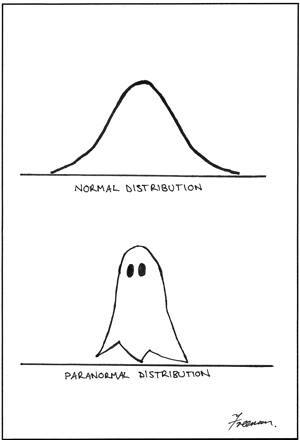
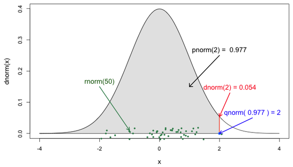

# Working with PDFs and PMFs in `R`

\

**Due Date**: Wednesday September 18th at midnight

Labs are submitted via Gradescope.

-   You will submit (1) a .Rmd file with your code and (2) a PDF of your code and output.
-   To generate a PDF of your code and output, **do not knit to PDF**. Instead, knit your .Rmd file as HTML, open the HTML file in a web browser, and then **print the HTML as a PDF, making sure that none of your code or output is cut off.** You can generate an HTML file in RStudio by pressing `Knit` and then `Knit to HTML`.
-   The knitting process will not work if there are errors in your code, so be sure to leave plenty of time to knit your lab notebooks before the deadline.

# ✅ Set up

Make sure to run the cell below. It imports additional useful functions, adjusts R settings, and loads in data.

```{r}
# Load in additional functions
library(tidyverse)
library(lubridate)

# Use three digits past the decimal point
options(digits = 3)

# Format plots with a white background and dark features.
theme_set(theme_bw())
```

## 🔔 Distributions in `R`

It's common to represent natural phenomena in terms of known probability distributions.

-   For example, we could model the height of individuals with a normal distribution with mean $\mu$ of 5.5 feet and a standard deviation $\sigma$ of 0.5 feet.

-   The Bernoulli and Uniform distributions, which we have seen in class, are also common probability distributions.

-   However, there are [lots of other probability distributions](https://en.wikipedia.org/wiki/List_of_probability_distributions), including the binomial distribution, the t-distribution, the Poisson distribution, the exponential distribution, and the beta distribution.

You can work with many distributions in `R` using the following notation: `<r,d,p,q><distribution_name>`

-   For example, `dnorm`, `pbinom`, `qpoisson`, and `rbeta` are valid `R` commands.

## 🔠 What do the four letters `<r,d,p,q>` stand for?

Here is the million-dollar picture for understanding distribution functions in `R`:



`rnorm`: **random draws** from the `normal` distribution

-   This function allows you to make random draws from a normal distribution.

-   For example, `rnorm(n = 10, mean = 0, sd = 1)` generates 10 random draws from a normal distribution with mean of 0 and a standard deviation (sd) of 1.

```{r}
# re-run this code several times to see how the output changes.
rnorm(n = 10, mean = 0, sd = 1)
```

`dnorm`: **density** of the `normal` distribution

-   Density is the height of a continuous distribution at a particular value in its support.

-   `dnorm(x, mean = 0, sd = 1)` gives the height of the normal distribution at `x` for a normal distribution with mean of 0 and a standard deviation (sd) of 1.

```{r}
# how does the output compare to the picture above?
dnorm(x = 0, mean=0, sd=1)
```

`pnorm`: **probability** from the `normal` distribution

-   `pnorm(q = 0, mean = 0, sd = 1)` area under the normal distribution from $x=-\infty$ to $x=0$.

-   In other words, `pnorm(q = 0, mean = 0, sd = 1)` is the probability of drawing a normal random variable less than or equal to 0.

```{r}
# how does the output compare to your intuition 
# about the symmetry of the normal distribution?
pnorm(q = 0, mean=0, sd=1)
```

`qnorm`: **quantile** of the `normal` distribution

-   A quantile is the x-value corresponding to a particular area under the normal distribution from $-\infty$ to `x`.

-   You can think of `qnorm` as the inverse of `pnorm`.

-   `qnorm(q = 0.5, mean = 0, sd = 1)` is the x-value that corresponds to the 50th percentile (i.e., 0.5 quantile) of the normal distribution.

```{r}
# how does the output compare to your intuition 
# about the symmetry of the normal distribution,
# and how does it relate to the previous code chunk?
qnorm(p = 0.5, mean=0, sd=1)
```

### 🚀 Exercises: Continuous Distributions

Suppose heights are normally distributed with a mean of 69 inches and a standard deviation of 3 inches.

(a) If I were to pick a person at random, what is the probability they are taller than 72 inches?

```{r}
# Your code here!

```

(b) What is the IQR of height?

```{r}
# Your code here!

```

(c) What is the probability that a randomly selected person is between 66 and 72 inches tall?

```{r}
# Your code here!

```

Suppose $X \sim \text{Unif}(20, 80)$. Using `R`, compute $\Pr(30 < X < 70)$.

-   Run `?dunif` to see the documentation the uniform distribution in `R`.

-   Run `?Distributions` to see the documentation for all of the distributions in `R`.

```{r}
# Your code here!

```

Suppose $X \sim \text{Beta}(\alpha = 3, \beta = 1)$. Using `R`, compute $\Pr(X < 0.5)$.

```{r}
# Your code here!


```

🤔 **Challenge question (optional)**

The function below always returns its input value, so long as the input is a number and the number is not too big.

In a code comment, explain why.

```{r}
boring_function = function(x) {
  qnorm(pnorm(x, mean=0, sd=1), mean=0, sd=1)
}

boring_function(-100)
boring_function(-10)
boring_function(-5)
boring_function(-1)
boring_function(-0.1)
boring_function(0.1)
boring_function(1)
boring_function(5)
boring_function(10)
boring_function(100)

# Your code comment here!

```

### 🚀 Exercises: Discrete Distributions

The same four letters `<r,d,p,q>` apply to discrete distributions, with just one difference:

-   For discrete distributions, `d` refers to the height of the probability mass function (PMF) at a particular value in the support, which represents the probability of drawing that value.

The **binomial** distribution represents the number of successes in a fixed number of Bernoulli coin flips.

For example, `rbinom(n = 10, size = 1, prob = 0.5)` generates 10 random coin flips.

-   `size=1` means flip one coin at a time.

-   `n=10` means flip the single coin 10 times.

```{r}
# Increase `size` to 5. How do the results change?
# Increase `n` to 20. How do the results change?
rbinom(n = 10, size = 1, prob = 0.5)
```

`dbinom(x = 3, size = 5, prob = 0.5)` provides the probability of getting exactly 3 heads in 5 coin flips:

-   `size` is the number of coins to flip.

-   `x` is the number of heads (1s).

```{r}
dbinom(x = 3, size = 5, prob = 0.5)
```

Using `R`, compute the probability of getting 3 or fewer heads in 5 coin flips.

-   Hint: Which of `<d,p,q,r>` is relevant to this question?

```{r}
# Your code here!

```

Suppose $X \sim \text{Poisson}(\lambda = 3)$. Using `R`, compute $\Pr(X = 2)$.

```{r}
# Your code here!

```

## 🎨 Drawing distributions with `ggplot2`

We can use `geom_function` to draw distributions.

-   Notice that we do not need to pass in any data to the `ggplot` function.

```{r}
ggplot() +
  geom_function(
    # dnorm is the density of the normal distribution
    fun = dnorm, 
    
    # parameters of the distribution
    # these are arguments to pass to the `dnorm` function
    args = list(mean = 0, sd = 1),
    
    # range of x-values to plot
    xlim = c(-3, 3)
  )
```

### 🚀 Exercises

Draw a plot of the `beta` distribution with parameters $\alpha = 3$ and $\beta = 2$.

-   No need to add any formatting to the plot.

```{r}
# Your code here!

```

Draw a plot of the `binomial` distribution with `size=10` and `prob=0.5`. Then, write a code comment interpreting the meaning of the plot.

-   Set your x-axis limits to be between 0 and 10.

-   Again, no need to the format the plot.

-   You will see a lot of warnings with this plot. Do not worry about them! But, as a challenge question, you might think about why these warnings are happening.

```{r}
# Your code and answer as a code comment here!

```

Plot a density histogram of 1000 random draws from a normal distribution with mean 0 and standard deviation 1. This is known as a **standard normal distribution.**

-   Passing `y = ..density..` to `aes` inside of `geom_histogram` will plot the density instead of the count.
-   You will want to pass 1000 random draws from a standard normal distribution to `x` inside of `aes` within `geom_histogram`.

Then, draw the real standard normal distribution on top of your histogram using `geom_function`.

-   Remember that we can layer `geom_*`'s on top of each other by adding (`+`) them together.

```{r}
# Your code here!

```
