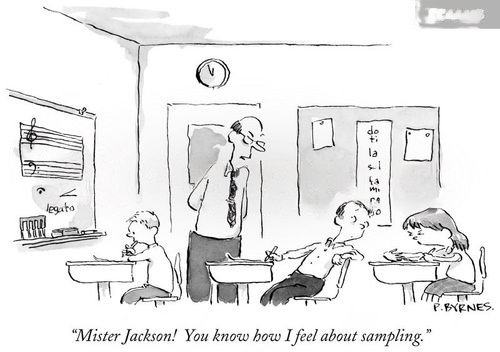

# Simulating the sampling distribution with `R`

\

**Due Date**: Monday September 23rd at midnight.

-   **Your Lab 3 submission must also included a completed PDF of the Lecture 8 worksheet.** We recommend that you complete the worksheet before attempting the lab.
-   You can ignore the two normal distribution plots at the very end of the worksheet.

Labs are submitted via Gradescope.

-   You will submit (1) a .Rmd file with your code, (2) a PDF of your code and output, and (3) a PDF of your completed Lecture 8 worksheet.
-   To generate a PDF of your code and output, **do not knit to PDF**. Instead, knit your .Rmd file as HTML, open the HTML file in a web browser, and then **print the HTML as a PDF, making sure that none of your code or output is cut off.** You can generate an HTML file in RStudio by pressing `Knit` and then `Knit to HTML`.
-   The knitting process will not work if there are errors in your code, so be sure to leave plenty of time to knit your lab notebooks before the deadline.

# ✅ Set up

Make sure to run the cell below. It imports additional useful functions, adjusts R settings, and loads in data.

```{r}
# Load in additional functions
library(tidyverse)
library(lubridate)

# Use three digits past the decimal point
options(digits = 3)

# Format plots with a white background and dark features.
theme_set(theme_bw())
```

## 🪙 Using `R` to generate data from a known distribution

We learned in Lab 2 that functions of the form `r<distribution>`, such as `rnorm`, `runif`, and `rbinom`, can be uses to generate `r`andom samples from a known probability distribution.

For example, to generate 10 coin flips, we can use `rbinom`:

```{r}
# n: number of trials
# size: number of coins to flip per trial. For Bernoulli coin flips, set this to 1.
# prob: probability of heads
rbinom(n = 10, size = 1, prob = 0.5)
```

### 🚀 Exercise 1

Write a `for`-loop to do the following:

1.  Flip 10 coins.
2.  Record the proportion of heads in the 10 flips.
3.  Repeat steps 1 and 2 1000 times.

Store the 1000 sample proportions in a vector.

Last, make a histogram of the proportions.

-   In this lab, there is no need to format plots beyond the defaults, unless you want to.

What do you notice about the shape of the histogram? Write your answer as a code comment.

```{r}
# Your code here!

# Basic for-loop syntax, to help get you started
for (i in 1:100) {
  # do something each iteration!
}

```

## 👥 The `replicate` function

`for`-loops do not take advantage of the vectorized nature of `R`.

-   In other words, the `for`-loop computes each sample proportion **serially**, or one at a time.

Coarsely, the `replicate` function computes the sample proportions in **parallel**, or simultaneously.

-   These kinds of **vectorized** computations are a lot faster, especially for complex tasks!

-   Note that the `n` argument in `replicate` is the number of replications, while the `n` argument in `rbinom` is the number of coin flips.

```{r}
# Flip 10 coins, and repeat 5 times
replicate(n = 5, mean(rbinom(n = 10, size = 1, prob = 0.5)))
```

```{r}
# More readably:

# Function to flip n coins with probability p of heads
coin_flipper = function(n, p) {
  mean(rbinom(n = n, size = 1, prob = p))
}

# Run the coin_flipper function 5 times
replicate(n = 5, coin_flipper(n = 10, p = 0.5))
```

### 🚀 Exercise 2

Repeat Exercise 1, but use `replicate` instead of a `for`-loop.

-   You are encouraged to use the `coin_flipper` function above!

-   Your plot should be nearly identical, so no need to write another plot comment.

```{r}
# Your code here!

```

### 🚀 Exercise 3

Repeat Exercise 1, but increase the number of replications from 1,000 to 100,000.

Aside from the y-axis, has the plot meaningfully changed? Why or why not?

-   Answer in a code comment.

```{r}
# Your code here!

```

### 🚀 Exercise 4

Repeat Exercise 1, but increase the number of coin flips to 100.

Aside from the y-axis, has the plot meaningfully changed? Why or why not?

-   Answer in a code comment.

```{r}
# Your code here!

```

### 🚀 Exercise 5

Estimate the standard error of the sample proportion estimator for the following two cases:

1.  n=10, p=0.5

2.  n=100, p=0.5

Then, calculate the ratio of the first SE to the second SE.

-   Theory predicts that increasing the sample size by a factor of $c$ will decrease the standard error by a factor of $\sqrt{c}$.

-   Is your observed ratio consistent with theory? Justify your answer with a computation.

Hint: You may be able to re-use results from Exercises 1 and 5.

```{r}
# Your code here!

```

### 🚀 Exercise 6

Construct the approximate sampling distribution of the sample proportion when for 10 coin flips, where the probability of heads is 0.1.

-   Does the sampling distribution appear normal? Why or why not? Answer in a code comment.

```{r}
# Your code here!

```

### 🚀 Exercise 7

Construct the approximate sampling distribution of the sample proportion when for 100 coin flips, where the probability of heads is 0.1.

-   Does the sampling distribution appear normal? Why or why not? Answer in a code comment.

```{r}
# Your code here!

```

### 🚀 Exercise 8

Construct the approximate sampling distribution of the sample **median** for 10 draws from a **uniform** distribution with parameters `a = -5` and `b = 5`.

-   Describe the shape of the sampling distribution. Answer in a code comment.

```{r}
# Your code here!

```

### 🚀 Exercise 9

Construct the approximate sampling distribution of the sample **maximum** for 10 draws from a **uniform** distribution with parameters `a = -5` and `b = 5`.

-   Describe the shape of the sampling distribution. Answer in a code comment.

```{r}
# Your code here!

```
