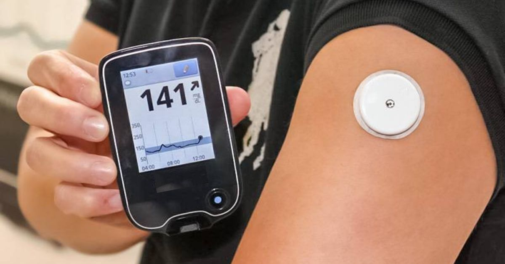

# 🩸 Lab 4, Part A: Blood glucose and the bootstrap with `R`

\

\

**Due Date**: Wednesday October 2nd at midnight.

-   **Your Lab 4 submission must also included a completed PDF of the Lecture 9 worksheet.** We recommend that you complete the worksheet before attempting the lab.

Labs are submitted via Gradescope.

-   You will submit (1) a .Rmd file with your code, (2) a PDF of your code and output, and (3) a PDF of your completed Lecture 9 worksheet.
-   To generate a PDF of your code and output, **do not knit to PDF**. Instead, knit your .Rmd file as HTML, open the HTML file in a web browser, and then **print the HTML as a PDF, making sure that none of your code or output is cut off.** You can generate an HTML file in RStudio by pressing `Knit` and then `Knit to HTML`.
-   The knitting process will not work if there are errors in your code, so be sure to leave plenty of time to knit your lab notebooks before the deadline.

# ✅ Set up

Make sure to run the cell below.
It imports additional useful functions, adjusts R settings, and loads in data.

```{r}
# Load in additional functions
library(tidyverse)
library(lubridate)

# Use three digits past the decimal point
options(digits = 3)

# Format plots with a white background and dark features.
theme_set(theme_bw())

# Load in the data
data = read_csv("https://jdgrossman.com/assets/hba1c-cgm-data.csv")

head(data)
```

## 🩸 Background info on blood glucose, HbA1c, and CGMs

[Diabetes mellitus](https://en.wikipedia.org/wiki/Diabetes) is a group of diseases characterized by an inability of the body to properly maintain healthy blood glucose levels.

-   Having high blood glucose for long periods of time can lead to [serious health complications](https://www.cdc.gov/diabetes/managing/problems.html), such as nerve damage and heart disease.

The [glycated hemoglobin (HbA1c)](https://en.wikipedia.org/wiki/Glycated_hemoglobin) test was introduced in the late 1970s as a way to monitor long-term trends in blood glucose levels.

-   HbA1c values above 6.4% are typically indicative of diabetes.
    Values above 7% are associated with long-term complications, with higher values associated with more severe complications.

-   Patients with diabetes are typically instructed to have their blood drawn every three months to monitor their HbA1c.

[Continuous glucose monitors (CGMs)](https://en.wikipedia.org/wiki/Continuous_glucose_monitor) allow patients with diabetes to see a real-time output of their blood glucose levels.

-   The picture at the top of this lab is an example of a CGM.

-   The first CGM was introduced in 1999, but CGM adoption did not begin to accelerate until about 10 years later.

-   Thus, HbA1c measurement is still the gold standard for predicting long-term health outcomes in patients with diabetes, as there simply has not been as much time for CGM measurements to be formally correlated with longer-term health outcomes.

> To see Josh's current CGM output, visit [this website](https://jgrossman-new.herokuapp.com).

In a later lab, we will assess the relationship between CGM output and HbA1c among a sample of 100 patients with diabetes.
In this lab, you will begin working the same dataset.
For each patient, you have the following data:

1.  `a1c_value`: An HbA1c measurement. HbA1c is often abbreviated as A1c.
2.  `mean_bg`: The patient's CGM-measured average blood glucose (BG) in the several weeks or months before their HbA1c was measured.
3.  `time_in_range`: The proportion of CGM blood glucose measurements that were in the healthy range of 70 mg/dL to 180 mg/dL. Often abbreviated as TIR.

For the purposes of this assignment, you can assume that the 100 patients in the data were randomly drawn from the same population.

### 🚀 Exercise 1

Suppose the 100 patients in the dataset were randomly drawn from a large population of patients with diabetes.

Provide an estimate of the average time in range of this large population.

```{r}
# Your code here!

```

### 🚀 Exercise 2

Suppose you are an analyst at a government agency.

-   A policymaker asks you to estimate the average time in range of the entire patient population in order to make an informed decision about a new public health initiative.

Unfortunately, your point estimate does not convey the uncertainty inherent in your best guess.

-   So, we want to construct a **confidence interval** for the population average time in range.

-   To construct a confidence interval, we need to estimate the **standard error** of our sample mean estimator.

Using the formula for the estimated standard error of a sample mean (provided in Lecture 8b), estimate the standard error of the sample mean time in range.

```{r}
# Your code here!

```

## 🤔 Inference with estimators other than proportions and averages

We do not always have a formula to estimate the standard error of an estimator.

-   For example, how would we go about calculating the standard error of the 90th percentile of a distribution? It's not so simple!

In these scenarios, standard errors are typically computed via the **bootstrap**.

-   To keep things simple, we will use the bootstrap to estimate the standard error of the sample mean time in range, even though we already have an analytic formula for this standard error.

-   We will compare our bootstrap estimate of the standard error to the standard error we calculated above with the analytic formula.

## 🥜 The bootstrap, in a nutshell

Here's a process that would provide a nice approximation of the true standard error of the sample average time in range:

1.  Take many (i.e., 10,000) random samples of 100 patients ("parallel universes")

2.  Calculate the average time in range of each sample of 100 patients.

3.  Compute the standard deviation of the estimates across the 10,000 parallel universes.

The problem: parallel universes aren't easily accessible.

-   We usually get just one shot at sampling!

A side door proposal:

-   First, we have to be willing to assume that our original patient sample is sufficiently representative of the unobserved patient population.

-   The, we could randomly draw **new, synthetic samples** from our original sample to construct synthetic parallel universes.

-   Now that we have access to many synthetic parallel universes, we could proceed with the process described above.
    **This is the core idea of the bootstrap.**


## 👢 Bootstrap sampling

We can create a synthetic parallel universe by **resampling from our observed data with replacement**.

-   Then, we can compute a synthetic estimate of the average time in range using this new, synthetic sample.

For example, imagine we put the 100 sampled patients in a room.

-   We select patients one at a time.

-   After we select a patient, we record their time in range, and then we put the patient back in the room.

-   So, the same patient's time in range may be recorded multiple times!

-   We repeat this process until we have recorded 100 time in range values.

-   Finally, we find the average of these 100 time in range values.

Here is the bootstrap resampling process in compact form:

Let $X_i$ be the time in range of patient $i$.

1.  Draw $X_1^*,\dots,X_{100}^* \sim \hat{F}_{100}$
2.  Compute $\bar{x}^*_{\text{synth}} = \frac{1}{100} \sum_{i=1}^{100} X_i^*$

Step one is a compact way of saying "draw 500 observations from our original sample with replacement."

-   $\hat{\text{F}}_n$ is known as the **empirical distribution function** for a sample size of $n$. $\hat{\text{F}}_n$ assigns a probability mass of $1/\text{n}$ to each sample observation.

$\bar{x}^*_{\text{synth}}$ is the mean time in range of the synthetic sample of 100 patients.

-   A star$^*$ next to a term implies that it's a synthetic term. In other words, it's not from a real sample or an estimate based on a real sample.


Let's try this in `R`!

### 🚀 Exercise 3

Use the `sample` function to draw a single bootstrap sample of 100 time in range values from the original data.

-   Then, calculate the average time in range of the synthetic sample.
-   See `Lab 0`, PingPong, or `?sample` for a refresher on the `sample` function!

```{r}
# Your code here!

```

### 🚀 Exercise 4

Next, use the `replicate` function to create 10,000 synthetic estimates of the average time in range.

-   Then, find the standard deviation of these 10,000 synthetic estimates.

-   How does this synthetic standard error compare to the analytic standard error you calculated in Exercise 1?
    Answer in a code comment.

```{r}
# Your code here!

```

### 🚀 Exercise 5

Write a function called `calculate_boot_se` that computes an estimate of the synthetic standard error for **any sample** of data.

Your function should take the following inputs:

-   `v`: a vector of the values in your sample.
-   `f`: a function that computes a point estimate given a sample of data.
-   `B`: the number of `B`ootstrap resamples.

For example, to repeat the process above, you would call `calculate_boot_se(v = data$time_in_range, f = mean, B = 10000)`.

-   Test your function by making sure it returns a similar bootstrap standard error to the one you calculated in Exercise 4!

```{r}
# Your code here!

```
