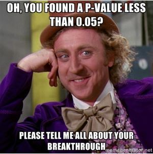
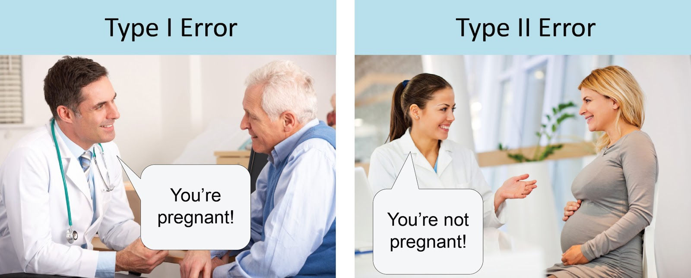

# 🎲 Lab 6: Multiple testing via simulation

\

\

**Due Date**: Wednesday, October 23rd at midnight.

Labs are submitted via Gradescope.

-   You will submit (1) a .Rmd file with your code, (2) a PDF of your code and output.
-   To generate a PDF of your code and output, **do not knit to PDF**. Instead, knit your .Rmd file as HTML, open the HTML file in a web browser, and then **print the HTML as a PDF, making sure that none of your code or output is cut off.** You can generate an HTML file in RStudio by pressing `Knit` and then `Knit to HTML`.
-   The knitting process will not work if there are errors in your code, so be sure to leave plenty of time to knit your lab notebooks before the deadline.

# ✅ Set up

Make sure to run the cell below.
It imports additional useful functions, adjusts R settings, and loads in data.

```{r}
# Initialize everyone's random number generator to be the same
set.seed(1)

# Load in additional functions
library(tidyverse)
library(lubridate)

# Use three digits past the decimal point
options(digits = 3)

# Format plots with a white background and dark features.
theme_set(theme_bw())
```

## 💊 Two anxiety drugs that don't work

Suppose that, without any external intervention, anxiety levels tend to randomly fluctuate from month to month.

-   In expectation, anxiety levels do not change from month to month.

-   But, if measured on a 1 through 100 scale, anxiety levels tend to randomly fluctuate on their own by usually no more than 6 points in a given month.

-   We could model these fluctuations as follows:

```{r}
# On average, anxiety levels do not change.
average_change = 0

# If we model fluctuations as a normal distribution,
# and if fluctuations are usually below 6 points, 
# and if 3 SDs cover 99.7% of a normal distribution,
# then the standard deviation of the fluctuations might be 6 / 3 = 2
sd_anxiety = 2

# Simulate anxiety changes of 100 patients
n_patients = 100
patients = rnorm(n_patients, mean = average_change, sd = sd_anxiety)

head(patients)
```

Now, suppose Drug 1 and Drug 2 are two new drugs intended to reduce anxiety levels.

-   However, assume that Drug 1 and Drug 2 **do not have any actual effect on anxiety**.

In a clinical trial, participants are randomly assigned to either Drug 1 or Drug 2.

-   The anxiety levels of participants are measured at the beginning of the experiment, and after one month of taking the drug.

-   The difference in anxiety levels is calculated for each participant.

-   Again, we can model this scenario:

```{r}
# Simulate anxiety changes of 100 patients assigned to drug 1
# Remember, drug 1 has no effect
patients_drug1 = rnorm(n_patients, mean = average_change, sd = sd_anxiety)
head(patients_drug1)

# Simulate anxiety changes of 100 patients assigned to drug 2
# Remember, drug 2 has no effect
patients_drug2 = rnorm(n_patients, mean = average_change, sd = sd_anxiety)
head(patients_drug2)
```

### 🚀 Exercise 1

Using `t.test`, conduct a hypothesis test comparing the purported effects of Drug 1 and Drug 2 on anxiety.

-   Be sure to specify the null hypothesis.

-   According to your test, is there a significant difference in the effect sizes?

```{r}
# Your code here!

```

### 🚀 Exercise 2

Suppose that there are actually 20 different research groups investigating the difference between Drug 1 and Drug 2.

-   Each research group conducts a hypothesis test comparing Drug 1 and Drug 2, using different samples of 100 patients assigned to Drug 1 and 100 patients assigned to Drug 2.

-   Among these 20 research groups, how many should expect to find a significant difference between Drug 1 and Drug 2 at the alpha=0.05 level?

-   Do your simulation results match your expectation? Re-run your simulation a couple times to confirm.

-   Hint 1: You may find it helpful to write a function that generates two samples of patients of size `n`, conducts a t-test, and returns the p-value.
    Then, run this function 20 times with `replicate`.

-   Hint 2: If you run a t-test with `t.test` and save the output to a variable called `test_result`, you can extract the p-value with `test_result$p-value`.

```{r}
# Your code here!


```

### 🚀 Exercise 3

Repeat Exercise 2, but this time, use the Bonferroni correction to control the familywise type I error rate (FWER).

- FWER: Probability of at least one type I error among N tests. 

- Type I error: Pr(Significant results | Null is true)

-   In expectation, how many research groups will find a significant difference between Drug 1 and Drug 2 at the alpha=0.05 level?

-   Does your simulation match this expectation? Re-run the simulation a couple times to confirm.

```{r}
# Your code here!

```

### 🚀 Exercise 4

Repeat Exercise 4 across 1000 parallel universes.

-   Across the 1000 parallel universes, where each parallel universe has 20 research groups and each group tests Drug 1 and Drug 2 with 100 patients each, what proportion of parallel universes reject the null hypothesis at least once?

-   Hint: You'll need to put a `replicate` inside of another `replicate`!

```{r}
# Your code here!

```
