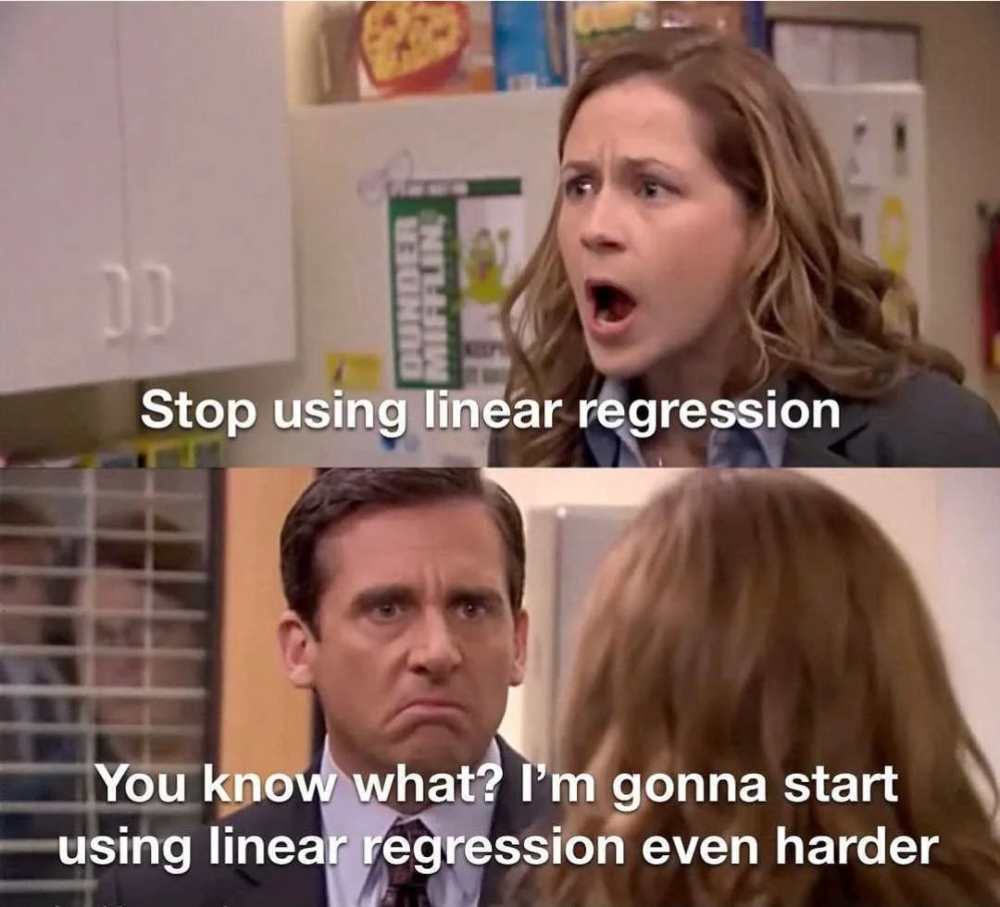

---
output:
  html_document:
    df_print: paged
editor_options: 
  markdown: 
    wrap: sentence
---

# 💵 Lab 9: Predicting income levels with a linear probability model (LPM)

\

**Due Date**: Friday, November 8th at midnight.

**Note:** Lab 8 is also due 11/8 at midnight!

Labs are submitted via Gradescope.

-   You will submit (1) a .Rmd file with your code, (2) a PDF of your code and output.
-   To generate a PDF of your code and output, **do not knit to PDF**. Instead, knit your .Rmd file as HTML, open the HTML file in a web browser, and then **print the HTML as a PDF, making sure that none of your code or output is cut off.** You can generate an HTML file in RStudio by pressing `Knit` and then `Knit to HTML`.
-   The knitting process will not work if there are errors in your code, so be sure to leave plenty of time to knit your lab notebooks before the deadline.

## ✅ Setup and data import

In this short lab, we will use an LPM to predict whether an individual in the [census income dataset](https://www.kaggle.com/datasets/uciml/adult-census-income) makes more than \$50,000 per year.

-   Note that this data is from 1994.

-   \$50,000 in 1994 dollars is equivalent to about **\$106,000 in 2024 dollars**.

```{r}
# Load in additional functions
library(tidyverse)
library(lubridate)

# Use three digits past the decimal point
# Don't use scientific notation
options(digits = 3, scipen=999)

# Format plots with a white background and dark features.
theme_set(theme_bw())

data = read_csv("data/adult.csv")

# peek at 10 random rows
sample_n(data, 10)
```

## 🚀 Exercise 1

Using `lm`, fit a linear probability model (LPM) predicting whether an individual makes more than \$50,000 per year.

-   Include an intercept, and include the `education` variable as the only predictor.

-   Print a summary of your model.

-   As a code comment, interpret the `educationDoctorate` coefficient.
    Does the sign of the coefficient make sense?

-   You may want to inspect the unique values of the `education` column.
    `unique` and `sort` may be helpful!

```{r}
# Your code and code comment here!

```

## 🚀 Exercise 2

Make a scatterplot with the following features:

-   Each point should represent one individual in the dataset.

-   On the y-axis, plot whether the individual makes more than \$50,000 per year.

-   On the x-axis, plot age.

-   Use `geom_smooth` with the argument `method="lm"` to plot the LPM predicting an annual income higher than \$50,000 using only age.

-   Within `geom_point`, set `alpha = 0.01` to make the points more transparent and reduce overplotting.

-   Does it look like a quadratic fit might be better than a linear fit?
    Explain in a code comment.

```{r}
# Your code and code comment here!

```

## 🚀 Exercise 3

Adjust your previous plot to include a quadratic term for age in the LPM.

-   You can do this by passing in `formula = y ~ x + I(x^2)` to `geom_smooth`.

```{r}
# Your code here!

```

## 🚀 Exercise 4

Use `lm` to fit two LPMs that confirm whether the quadratic fit is better than the linear fit.

-   In a code comment, explain your reasoning.
-   There is more than one correct metric for measuring the quality of fit!

```{r}
# Your code and code comment here!

```

## 🚀 Exercise 4

Fit an LPM predicting annual income over \$50,000 using `age`, `age`$^2$ and `education`.

-   Re-interpret the `educationDoctorate` coefficient in this updated model.

-   Why is the coefficient smaller in this model than in the original model?
    Explain in a code comment.

```{r}
# Your code and code comment here!

```
