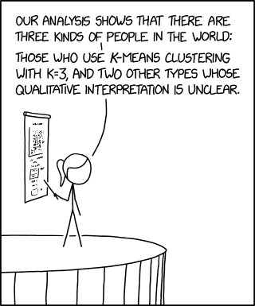

---
output:
  html_document:
    df_print: paged
editor_options: 
  markdown: 
    wrap: sentence
---

# 🍷 Lab 11: Clustering with k-means and principal component analysis (PCA)

\

**Due Date**: Friday, December 6th at midnight.

Labs are submitted via Gradescope.

-   You will submit (1) a .Rmd file with your code, (2) a PDF of your code and output.
-   To generate a PDF of your code and output, **do not knit to PDF**. Instead, knit your .Rmd file as HTML, open the HTML file in a web browser, and then **print the HTML as a PDF, making sure that none of your code or output is cut off.** You can generate an HTML file in RStudio by pressing `Knit` and then `Knit to HTML`.
-   The knitting process will not work if there are errors in your code, so be sure to leave plenty of time to knit your lab notebooks before the deadline.

## ✅ Setup and data import

In this lab, we will use k-means clustering and principal component analysis (PCA) to segment customers of a fictional food retailer.

-   The dataset we use (`marketing_campaign.csv`) is from [this Kaggle page](https://www.kaggle.com/datasets/imakash3011/customer-personality-analysis), which in turn obtained the data from a [business analyst hiring case study](https://github.com/nailson/ifood-data-business-analyst-test/tree/master) for a company called [iFood](https://en.wikipedia.org/wiki/IFood).

> Kaggle hosts many example datasets for exploring machine learning models. 

- Here is the description of the customer data from the case study: 

    - *"Consider a well-established company operating in the retail food sector. Presently they have around several hundred thousands of registered customers and serve almost one million consumers a year. They sell products from 5 major categories: wines, rare meat products, exotic fruits, specially prepared fish and sweet products. These can further be divided into gold and regular products. The customers can order and acquire products through 3 sales channels: physical stores, catalogs and company's"*

Each row of `marketing_campaign.csv` represents a particular customer.

-   You can read the descriptions of the columns [here](https://www.kaggle.com/datasets/imakash3011/customer-personality-analysis).

```{r}
# Load in additional functions
library(tidyverse)

# Use three digits past the decimal point
# Don't use scientific notation
options(digits = 3, scipen=999)

# Format plots with a white background and dark features.
theme_set(theme_bw())

data = read_csv("data/marketing_campaign.csv")

# peek at 10 random rows
sample_n(data, 10)
```

## 🚀 Exercise 1

Use the `summary()` function on the dataset. Does it look like any of the columns should be ignored or removed? Why or why not?

```{r}
# Your code and code comment here!

```

## 🚀 Exercise 2

`kmeans` is a built-in `R` function that performs k-means clustering.

- `kmeans(df, n_clusters)` will attempt to cluster the rows of `df` using `n_clusters` random data points as the initial centroids and **using all columns** to calculate the distance between points.

Run `k-means clustering` with `K=3` using just the `Income` and `MntWines` columns.

- You may run into issues with missing values. Address them appropriately! 

- Save the output to a variable called `kmeans_obj`.

- Print out `kmeans_obj`. Do you notice anything?

```{r}
# Your code and code comment here!

```

## 🚀 Exercise 3

`str(obj)` will tell you about the `str`ucture of an object.

- Run `str(kmeans_obj)`. Using the output, extract the vector of cluster assignments.

- Then, make a plot of the `Income` and `MntWines` columns, coloring the points by cluster assignment.

- No need to format the plot beyond the defaults! 

- Does it look like the clusters are "good"? Explain. To answer this question, you may find it helpful to modify the scale of your plot. 

```{r}
# Your code and code comment here!

```

## 🚀 Exercise 4

While we could certain run k-means clustering using all of the columns in the dataset, it would be difficult to visualize the resulting clusters.

- However, we could use PCA to reduce the dimensionality of the dataset, and then perform k-means clustering on the first and second principal components.

Run `prcomp()` on the two-column dataset you produced in Exercise 2.

- `prcomp(df, center=TRUE, scale.=TRUE)` performs PCA on all of the rows and columns of `df`, after centering and scaling (i.e., standardizing) each column.

- Save the output to a variable called `pca_obj`.

- Run `str(pca_obj)` to see what variables it contains. 

- The `sdev` variable inside `pca_obj` contains the standard deviations of each set of principal component (PC) scores.

- Using the `sdev` variable, calculate the proportion of **variance** explained by the first two principal components.

```{r}
# Your code and code comment here!

```

## 🚀 Exercise 5

Next, run PCA on the entire dataset.

- Think carefully about whether any columns in the dataset should be excluded, or if any missing values need to be addressed.

- `as.data.frame(model.matrix( ~ 0 + ., data))` will convert categorical columns of a dataframe called `data` into dummy variable columns that can be understood by the PCA algorithm. 

- By including `0 + .`, we tell `model.matrix` to not include an intercept column. We are not running a regression, so we do not need an intercept.

- We recommend using `View` on the dummified data frame so you can see how `model.matrix` modifies data. `model.matrix` is used pretty often for fitting models!

- Save your `prcomp()` output to a variable called `pca_obj`.

- How much of the total variance is explained by the first two principal components?

```{r}
# Your code and code comment here!

```

## 🚀 Exercise 6

Finally, plot the PC1 and PC2 scores.

- The `x` variable inside `pca_obj` contains the PC scores. 

- Each row corresponds to a data point, and each column corresponds to its PC scores for each PC.

- Does it look like there are any natural clusters? Explain.

```{r}
# Your code and code comment here!

```
